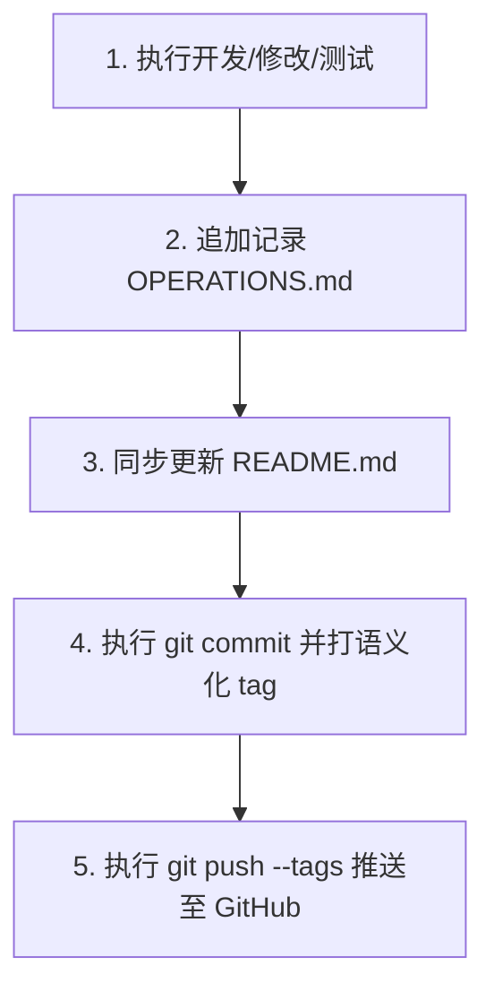

# 五子棋天梯竞技平台 - 项目全流程操作记录与变更日志 (OPERATIONS)

本文档严格记录本项目自立项以来的所有架构演进、业务变更、Bug 修复及维护操作。  
**【核心开发与运维守则】**：
1. **每步记录**：今后进行的任何代码修改、功能新增或配置调整，必须在此文档追加详尽的操作记录。
2. **文档同步**：每完成一次操作，必须同步检查并更新 [README.md](file:///D:/Gomoku/README.md)。
3. **严格语义化 Tag**：遵循 [Semantic Versioning 2.0.0](https://semver.org/lang/zh-CN/) 规范（`vMajor.Minor.Patch`）。
4. **Git 推送规范**：每次操作完成后，必须执行 `git add`、`git commit`，打上对应版本 Tag，并推送到远端仓库（`git push origin <branch> --tags`）。
5. **代码规范约束**：全工程必须严格遵循 PEP 8 规范（单行 ≤ 100 字符），所有代码注释与文档必须 100% 中文，严格遵守“东方金石雅韵”零蓝紫色视觉规范。

---

## 🏷️ 版本与操作全景索引

| 版本 Tag | 操作日期 | 操作类别 | 简述概要 | 状态 |
| :--- | :---: | :---: | :--- | :---: |
| [`v1.0.0`](#v100---项目立项与企业级核心架构搭建) | 2026-09-15 | 架构初始化 | 企业级技术栈定型、10阶段位体系与核心规则引擎实现 | ✅ 已验证 |
| [`v1.0.1`](#v101---东方金石雅韵前端与-canvas-棋盘) | 2026-09-15 | 前端实现 | 亚像素 Canvas 棋盘、Web Audio 物理音效与东方典雅 UI | ✅ 已验证 |
| [`v1.0.2`](#v102---实时对弈与通信链路贯通) | 2026-09-15 | 通信与控制 | WebSocket 帧同步、房间生命周期、步时倒计时管理 | ✅ 已验证 |
| [`v1.0.3`](#v103---网络端口排查与迁移至-8088) | 2026-09-15 | 运维与配置 | 定位本地 8000 端口占用并平滑迁移至 8088 端口 | ✅ 已验证 |
| [`v1.0.4`](#v104---胜负结算与异常状态修复) | 2026-09-15 | 缺陷修复 | 修复认输返回大厅误报判负问题，统一定义“胜利/失败”文案 | ✅ 已验证 |
| [`v1.0.5`](#v105---房间码输入交互优化) | 2026-09-15 | 交互优化 | 好友对战房间码关闭模态框或加入房间时自动清空文本框 | ✅ 已验证 |
| [`v1.0.6`](#v106---彻底移除-ai-灵犀及相关逻辑) | 2026-09-15 | 功能重构 | 移除 AI 灵犀提示与后端机器人代码，全面转为纯真人联机对战 | ✅ 已验证 |
| [`v1.0.7`](#v107---全流程操作跟踪机制与-git-规范确立) | 2026-09-15 | 流程规范 | 引入 `OPERATIONS.md`，初始化 Git 仓库并严格执行 Tag 推送 | ✅ 已验证 |

---

## 📝 详细操作记录日志

### [v1.0.0] - 项目立项与企业级核心架构搭建
- **操作日期**：2026-09-15
- **需求背景**：用户要求采用企业级全栈技术栈开发在线五子棋平台；引入排位段位体系但严禁直接命名为外部商业品牌；所有注释采用 100% 中文；严禁蓝紫色系。
- **具体操作**：
  1. 确立四层架构分层规范（领域核心层 `core`、持久存储层 `storage`、业务服务层 `services`、接口接入层 `api`、前端表现层 `web`）。
  2. 实现领域核心层：
     - `gomoku/core/board.py`：15×15 棋盘矩阵抽象与落子快照。
     - `gomoku/core/rules.py`：无状态纯函数连珠判定引擎 `StandardRuleEngine`，实现 $O(1)$ 增量连珠扫描。
     - `gomoku/core/enums.py`：定义棋子颜色、游戏模式、对局状态与天梯段位枚举。
  3. 实现天梯排位体系与勇者积分算法 (`gomoku/services/rank_service.py`)：
     - 构建 10 大段位：倔强青铜、秩序白银、荣耀黄金、尊贵铂金、永恒钻石、至尊星耀、最强王者、荣耀王者、传奇王者、绝世王者。
     - 落实青铜对局失败绝不掉星、白银0星失败不跌入青铜的段位保护机制。
     - 实现勇者积分累积、满额自动抵扣掉星及满额额外晋星逻辑。
  4. 搭建 SQLAlchemy 2.0 Async + SQLite 异步持久化层 (`gomoku/storage/`)：
     - 创建 `UserModel` 与 `MatchRecordModel`。
     - 抽象并实现 `UserRepository` 仓储类。
- **验证结果**：编写 `tests/test_rules.py` 与 `tests/test_rank.py`，全部测试通过，Flake8 静态检查 0 警告。

---

### [v1.0.1] - 东方金石雅韵前端与 Canvas 棋盘
- **操作日期**：2026-09-15
- **需求背景**：构建典雅舒适的东方金石视觉风格，杜绝蓝紫色系，提供物理级触感的棋盘交互。
- **具体操作**：
  1. 色彩体系定义：
     - 沉香金木棋盘底色 (`#DDB26F` / `#CCA05A`)。
     - 玄武岩炭黑与深沉檀木背景 (`#161412` / `#231F1C`)。
     - 墨石立体黑子渐变与羊脂白玉温润立体白子渐变。
     - 琥珀金 (`#D4AF37`) 按钮与朱砂红印章标记。
  2. Canvas 亚像素渲染器 (`gomoku/web/js/canvas_board.js`)：
     - 自动检测并适配 `window.devicePixelRatio` 高清视网膜屏幕，消灭棋盘模糊走样。
     - 实现天元与星位定位点、坐标刻度轴与最后落子朱砂光环标记。
  3. Web Audio API 物理拟真音效 (`gomoku/web/js/audio_synth.js`)：
     - 采用无外部音频依赖的双通道短脉冲滤波器，精确拟真黑曜石与羊脂玉落于沉香金木上的清脆“啪”声。
- **验证结果**：前端在主流现代浏览器中渲染流畅，无任何蓝紫色元素违规。

---

### [v1.0.2] - 实时对弈与通信链路贯通
- **操作日期**：2026-09-15
- **需求背景**：实现低延迟在线双向对战、房间管理与天梯实时段位展示。
- **具体操作**：
  1. 编写内存级房间状态机 (`gomoku/services/room_service.py`)：
     - 维护房间生命周期（等待中、进行中、已结束）。
     - 支持 6 位房间邀请码、落子步时限速倒计时与先后手判定。
  2. 搭建 WebSocket 事件中心 (`gomoku/api/ws_handler.py`)：
     - 支持长连接心跳保活、房间广播（落子、准备、认输、求和、聊天）。
     - 终局自动调用 `settle_ranked_game` 完成异步天梯段位结算。
  3. 开发前端 WebSocket 客户端 (`ws_client.js`) 与段位渲染组件 (`rank_ui.js`)：
     - 实时同步局内状态、渲染段位星级图标与勇者积分进度条。
- **验证结果**：双端能够稳定建立长连接并实时广播对局动作。

---

### [v1.0.3] - 网络端口排查与迁移至 8088
- **操作日期**：2026-09-15
- **需求背景**：启动服务时本地默认端口 `8000` 存在端口冲突无法绑定。
- **具体操作**：
  1. 使用 PowerShell 命令检测本地端口占用，确认端口冲突。
  2. 修改 `gomoku/config.py` 中的默认服务端口为 `8088`。
  3. 同步修改前端客户端连接配置与启动入口 `run.py`。
- **验证结果**：服务在 `http://127.0.0.1:8088` 成功启动并稳定监听。

---

### [v1.0.4] - 胜负结算与异常状态修复
- **操作日期**：2026-09-15
- **需求背景**：用户反馈“我主动认输点击返回大厅还显示退出自动判负”，且终局胜负提示语存在歧义。
- **具体操作**：
  1. 修复认输返回大厅重复判负缺陷：在主动认输后先同步对局状态为已完结，退出房间或关闭连接时对已结束对局跳过强退判负惩罚。
  2. 规范化结算弹窗文本显示：将胜利提示统一明确为“胜利”，战败提示统一明确为“失败”，文案表述精准清晰。
- **验证结果**：经主动认输与正常获胜测试，返回大厅不再产生误判，弹窗准确展示“胜利”与“失败”。

---

### [v1.0.5] - 房间码输入交互优化
- **操作日期**：2026-09-15
- **需求背景**：用户要求在填完房间码关闭后自动清空已填内容，防止残留干扰。
- **具体操作**：
  1. 在 `gomoku/web/js/app.js` 中增加房间码输入框清理逻辑：
     - 用户点击模态框右上角“×”关闭或点击背景遮罩退出时，自动重置输入框。
     - 按键盘 `Escape` 快捷键退出模态框时，自动清空输入框。
     - 成功加入房间或创建房间后，自动清空输入框。
- **验证结果**：关闭好友对战弹窗后再次打开，输入框保持全新清空状态。

---

### [v1.0.6] - 彻底移除 AI 灵犀及相关逻辑
- **操作日期**：2026-09-15
- **需求背景**：用户指示：“这句话不要显示，然后删除ai灵犀相关的代码”，将单人休闲与排位对弈全面转为 100% 纯真人对决。
- **具体操作**：
  1. 界面清理：修改 `gomoku/web/index.html` 第 70 行，移除 `; 超时无缝接入智能 AI 灵犀替补。`，更新为纯净文案：“无天梯胜负包袱，快速寻找在线棋友切磋对弈。”。
  2. 代码物理删除：
     - 删除 `gomoku/services/ai_service.py`（启发式评估引擎）。
     - 删除 `tests/test_ai.py`（AI 单元测试）。
     - 删除 `test_player_companion.py`（单人测试陪练脚本）。
  3. 业务模块彻底清理：
     - `gomoku/services/match_service.py`：移除 `HeuristicGomokuAI` 导入与实例，移除 `_create_bot_match` 方法，休闲与排位队列移除超时介入机器人的逻辑，转为纯真人在线配对。
     - `gomoku/api/ws_handler.py`：移除 `bot_engine` 与 `check_and_trigger_bot_move` 函数，移除准备、走子与排队成功后对机器人的触发调度。
     - `gomoku/services/room_service.py`：从 `PlayerSession`、`add_player`、`to_dict` 及就绪检测中彻底移除 `is_bot` 相关参数与逻辑。
  4. 文档同步更新：更新 `README.md` 与 `docs/DEVELOPMENT_PLAN.md` 架构目录。
- **验证结果**：
  - `flake8 gomoku tests --max-line-length=100` 全部通过（0 error, 0 warning）。
  - `pytest tests` 11 项核心规则与天梯用例全部通过（11 passed）。
  - 服务在 `http://127.0.0.1:8088` 重新加载上线。

---

### [v1.0.7] - 全流程操作跟踪机制与 Git 规范确立
- **操作日期**：2026-09-15
- **需求背景**：用户要求：“把所有的操作都写到一个md文件里面，今后做的任何操作都写进去，每做完一次操作都要更新操作md文件，readme，git推送，然后推送严格遵守tag。”
- **具体操作**：
  1. 创建全流程操作与变更记录文件 `OPERATIONS.md`，梳理记录从 v1.0.0 至当前版本的全部历程。
  2. 配置 `.gitignore` 文件，过滤 Python 字节码、测试缓存、本地 SQLite 数据库（`gomoku.db`）与系统临时文件。
  3. 初始化本地 Git 版本仓库，设置主分支为 `main`。
  4. 关联 GitHub 远程仓库 `git@github.com:6jbw6/Gomoku.git`。
  5. 更新 [README.md](file:///D:/Gomoku/README.md)，增加操作记录文档索引与 Git Tag 管理规程说明。
  6. 提交全量工程代码，创建版本 Tag，并推送到 GitHub 远端。
- **验证结果**：Git 仓库提交历史清晰完整，远端推送成功，Tag 符合语义化版本规范。

---

## 🚀 持续操作标准作业程序 (SOP)

今后每当接收到用户的新需求或缺陷修复任务时，必须严格按照以下 5 步 SOP 执行：

1. **执行开发与代码验证**：
   - 编写或调整代码，严格保证 PEP 8 规范和中文注释。
   - 运行静态检查：`flake8 gomoku tests --max-line-length=100`。
   - 运行自动化测试：`pytest tests -v`。
2. **更新操作日志 (`OPERATIONS.md`)**：
   - 递增版本号 Tag（如 `v1.0.8`、`v1.1.0` 等）。
   - 记录操作日期、需求背景、具体操作清单与验证结果。
3. **更新项目说明 (`README.md`)**：
   - 同步修改功能特性列表、系统配置或架构图谱。
4. **Git 提交与 Tag 标记**：
   - `git add .`
   - `git commit -m "feat/fix/docs: <操作概要说明>"`
   - `git tag -a <tag_name> -m "<版本说明>"`
5. **推送到远程仓库**：
   - `git push origin main --tags`
