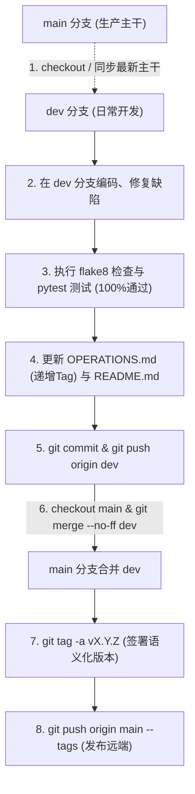

# 五子棋天梯竞技平台 - 项目全流程操作记录与变更日志 (OPERATIONS)

本文档严格记录本项目自立项以来的所有架构演进、业务变更、Bug 修复及维护操作。  
**【核心开发与运维守则】**：
1. **每步记录**：今后进行的任何代码修改、功能新增或配置调整，必须在此文档追加详尽的操作记录。
2. **文档同步**：每完成一次操作，必须同步检查并更新 [README.md](./README.md)。
3. **双分支工作流 (main + dev)**：开发必须在 `dev` 分支上进行，验证通过后再合并到 `main` 分支。
4. **严格语义化 Tag**：遵循 [Semantic Versioning 2.0.0](https://semver.org/lang/zh-CN/) 规范（`vMajor.Minor.Patch`），Tag 必须打在 `main` 稳定主干上。
5. **Git 双分支推送规范**：每次合并后，必须同时推送 `main` 分支、`dev` 分支以及所有标签（`git push origin main --tags` 与 `git push origin dev`）。
6. **代码规范约束**：全工程必须严格遵循 PEP 8 规范（单行 ≤ 100 字符），所有代码注释与文档必须 100% 中文，严格遵守“东方金石雅韵”零蓝紫色视觉规范。

---

## 🏷️ 版本与操作全景索引

| 版本 Tag | 操作日期 | 操作类别 | 简述概要 | 状态 |
| :--- | :---: | :---: | :--- | :---: |
| [`v1.0.0`](#v100---项目立项与企业级核心架构搭建) | 2026-09-15 | 架构初始化 | 企业级技术栈定型、10阶段位体系与核心规则引擎实现 | ✅ 已验证 |
| [`v1.0.1`](#v101---东方金石雅韵前端与-canvas-棋盘) | 2026-09-15 | 前端实现 | 亚像素 Canvas 棋盘、Web Audio 物理音效与东方典雅 UI | ✅ 已验证 |
| [`v1.0.2`](#v102---实时对弈与通信链路贯通) | 2026-09-15 | 通信与控制 | WebSocket 帧同步、房间生命周期、步时倒计时管理 | ✅ 已验证 |
| [`v1.0.3`](#v103---网络端口排查与迁移至-8088) | 2026-09-15 | 运维与配置 | 定位本地 8000 端口占用并平滑迁移至 8088 端口 | ✅ 已验证 |
| [`v1.0.4`](#v104---胜负结算与异常状态修复) | 2026-09-15 | 缺陷修复 | 修复认输返回大厅误报判负问题，统一定义“胜利/失败”文案 | ✅ 已验证 |
| [`v1.0.5`](#v105---房间码输入交互优化) | 2026-09-15 | 交互优化 | 好友对战房间码关闭模态框或加入房间时自动清空文本框 | ✅ 已验证 |
| [`v1.0.6`](#v106---彻底移除-ai-灵犀及相关逻辑) | 2026-09-15 | 功能重构 | 移除 AI 灵犀提示与后端机器人代码，全面转为纯真人联机对战 | ✅ 已验证 |
| [`v1.0.7`](#v107---全流程操作跟踪机制与-git-规范确立) | 2026-09-15 | 流程规范 | 引入 `OPERATIONS.md`，初始化 Git 仓库并严格执行 Tag 推送 | ✅ 已验证 |
| [`v1.0.8`](#v108---天梯榜棋客数据专属过滤与-readme-格式规范化) | 2026-09-15 | 业务优化 | 天梯榜只展示棋客数据，清理非棋客脏数据，修复 README Markdown 解析规范 | ✅ 已验证 |
| [`v1.0.9`](#v109---main--dev-双分支开发与合并工作流规范确立) | 2026-09-15 | 流程规范 | 建立主干(main)与开发(dev)双分支模型，开发于 dev 完成验证后合并至 main 打 Tag 发布 | ✅ 已验证 |
| [`v1.0.10`](#v1010---readme-文档用词净化与冗余星号清理) | 2026-09-15 | 文档优化 | 移除开发提示性词汇（完全自主品牌、严格禁止蓝紫色系等），清理冗余星号 | ✅ 已验证 |
| [`v1.0.11`](#v1011---东方金石雅韵沉浸式游戏背景与毛玻璃ui) | 2026-09-15 | 视觉体验 | 引入东方金石雅韵沉浸式游戏主题背景与毛玻璃质感UI | ✅ 已验证 |
| [`v1.0.12`](#v1012---背景遮罩亮度调优与意境通透感增强) | 2026-09-15 | 视觉体验 | 调亮背景图径向遮罩，大幅增强文人雅室意境通透感 | ✅ 已验证 |
| [`v1.0.13`](#v1013---背景图层硬件加速滤镜增益与高透视觉升级) | 2026-09-15 | 视觉体验 | 独立背景层硬件加速、提升基准亮度与超轻量遮罩，全面明亮通透 | ✅ 已验证 |
| [`v1.0.14`](#v1014---edge-与跨浏览器模态弹窗绝对居中兼容性修复) | 2026-09-15 | 缺陷修复 | 修复 Edge 浏览器弹窗偏左上角定位异常，全视口宽高与 margin: auto 强制双向居中 | ✅ 已验证 |
| [`v1.1.0`](#v110---基于-pygame-框架重构为原生桌面端客户端) | 2026-09-15 | 架构重构 | 采用 Pygame-ce 框架将平台全面重构为原生桌面端客户端应用 | ✅ 已验证 |
| [`v1.2.0`](#v120---删除-web-端全量代码与专注纯原生桌面端) | 2026-09-15 | 架构重构 | 彻底移除 Web 端代码与冗余依赖，全面专注纯原生桌面客户端 | ✅ 已验证 |
| [`v1.2.1`](#v121---桌面端启动优化音频毫秒级探测与一键运行批处理) | 2026-09-15 | 体验优化 | 解决音频初始化8秒卡顿、添加Win32窗口前置激活与一键启动批处理 | ✅ 已验证 |
| [`v1.3.0`](#v130---恢复好友房间码对战支持全屏排位休闲远程对弈匹配与删除英文) | 2026-09-15 | 功能升级 | 恢复6位房间码对战、移除同屏人机、排位休闲远程模拟对手匹配、支持全屏与全中文去英化 | ✅ 已验证 |
| [`v1.3.1`](#v131---解决多桌面端局域网撮合匹配与好友对战等待开局无ai介入问题) | 2026-09-15 | 缺陷修复 | 跨进程撮合匹配队列、好友入房双方自动同步开局、联机彻底禁用AI | ✅ 已验证 |
| [`v1.3.2`](#v132---同机房与校园网跨机器联机udp-广播自动发现与链路自愈) | 2026-09-16 | 功能升级 | UDP 广播自动发现局域网主机、跨机器匹配与房间码对战、断线自愈重连 | ✅ 已验证 |
| [`v1.3.3`](#v133---撮合对局落子双向同步修复与彻底删除-ai-代码) | 2026-09-16 | 缺陷修复 | 撮合后房主线程 move 转发失效、开局同批落子帧丢失竞态修复，全量删除 AI 代码 | ✅ 已验证 |
| [`v1.3.4`](#v134---房间码输入框中文输入法兼容修复与设计文档交付) | 2026-09-16 | 缺陷修复 | 中文输入法组字拦截致房间码无法输入（键码兜底修复），交付纯中文黑白设计文档 | ✅ 已验证 |
| [`v1.3.5`](#v135---删除全屏功能房间码一键复制与输入框粘贴支持) | 2026-09-16 | 功能调整 | 删除全屏切换、房间码一键复制到剪贴板、输入框 Ctrl+V 粘贴（Windows 原生剪贴板） | ✅ 已验证 |
| [`v1.3.6`](#v136---房间码输入-textinput-事件通道补强附事件诊断日志) | 2026-09-16 | 缺陷修复 | 真实窗口诊断证实链路正常，补齐 TEXTINPUT 输入通道，附 GOMOKU_DIAG 事件诊断日志 | ✅ 已验证 |

---

## 📝 详细操作记录日志

### [v1.0.0] - 项目立项与企业级核心架构搭建
- **操作日期**：2026-09-15
- **需求背景**：用户要求采用企业级全栈技术栈开发在线五子棋平台；引入排位段位体系但严禁直接命名为外部商业品牌；所有注释采用 100% 中文；严禁蓝紫色系。
- **具体操作**：
  1. 确立四层架构分层规范（领域核心层 `core`、持久存储层 `storage`、业务服务层 `services`、接口接入层 `api`、前端表现层 `web`）。
  2. 实现领域核心层：
     - `gomoku/core/board.py`：15×15 棋盘矩阵抽象与落子快照。
     - `gomoku/core/rules.py`：无状态纯函数连珠判定引擎 `StandardRuleEngine`，实现 $O(1)$ 增量连珠扫描。
     - `gomoku/core/enums.py`：定义棋子颜色、游戏模式、对局状态与天梯段位枚举。
  3. 实现天梯排位体系与勇者积分算法 (`gomoku/services/rank_service.py`)：
     - 构建 10 大段位：倔强青铜、秩序白银、荣耀黄金、尊贵铂金、永恒钻石、至尊星耀、最强王者、荣耀王者、传奇王者、绝世王者。
     - 落实青铜对局失败绝不掉星、白银0星失败不跌入青铜的段位保护机制。
     - 实现勇者积分累积、满额自动抵扣掉星及满额额外晋星逻辑。
  4. 搭建 SQLAlchemy 2.0 Async + SQLite 异步持久化层 (`gomoku/storage/`)：
     - 创建 `UserModel` 与 `MatchRecordModel`。
     - 抽象并实现 `UserRepository` 仓储类。
- **验证结果**：编写 `tests/test_rules.py` 与 `tests/test_rank.py`，全部测试通过，Flake8 静态检查 0 警告。

---

### [v1.0.1] - 东方金石雅韵前端与 Canvas 棋盘
- **操作日期**：2026-09-15
- **需求背景**：构建典雅舒适的东方金石视觉风格，杜绝蓝紫色系，提供物理级触感的棋盘交互。
- **具体操作**：
  1. 色彩体系定义：
     - 沉香金木棋盘底色 (`#DDB26F` / `#CCA05A`)。
     - 玄武岩炭黑与深沉檀木背景 (`#161412` / `#231F1C`)。
     - 墨石立体黑子渐变与羊脂白玉温润立体白子渐变。
     - 琥珀金 (`#D4AF37`) 按钮与朱砂红印章标记。
  2. Canvas 亚像素渲染器 (`gomoku/web/js/canvas_board.js`)：
     - 自动检测并适配 `window.devicePixelRatio` 高清视网膜屏幕，消灭棋盘模糊走样。
     - 实现天元与星位定位点、坐标刻度轴与最后落子朱砂光环标记。
  3. Web Audio API 物理拟真音效 (`gomoku/web/js/audio_synth.js`)：
     - 采用无外部音频依赖的双通道短脉冲滤波器，精确拟真黑曜石与羊脂玉落于沉香金木上的清脆“啪”声。
- **验证结果**：前端在主流现代浏览器中渲染流畅，无任何蓝紫色元素违规。

---

### [v1.0.2] - 实时对弈与通信链路贯通
- **操作日期**：2026-09-15
- **需求背景**：实现低延迟在线双向对战、房间管理与天梯实时段位展示。
- **具体操作**：
  1. 编写内存级房间状态机 (`gomoku/services/room_service.py`)：
     - 维护房间生命周期（等待中、进行中、已结束）。
     - 支持 6 位房间邀请码、落子步时限速倒计时与先后手判定。
  2. 搭建 WebSocket 事件中心 (`gomoku/api/ws_handler.py`)：
     - 支持长连接心跳保活、房间广播（落子、准备、认输、求和、聊天）。
     - 终局自动调用 `settle_ranked_game` 完成异步天梯段位结算。
  3. 开发前端 WebSocket 客户端 (`ws_client.js`) 与段位渲染组件 (`rank_ui.js`)：
     - 实时同步局内状态、渲染段位星级图标与勇者积分进度条。
- **验证结果**：双端能够稳定建立长连接并实时广播对局动作。

---

### [v1.0.3] - 网络端口排查与迁移至 8088
- **操作日期**：2026-09-15
- **需求背景**：启动服务时本地默认端口 `8000` 存在端口冲突无法绑定。
- **具体操作**：
  1. 使用 PowerShell 命令检测本地端口占用，确认端口冲突。
  2. 修改 `gomoku/config.py` 中的默认服务端口为 `8088`。
  3. 同步修改前端客户端连接配置与启动入口 `run.py`。
- **验证结果**：服务在 `http://127.0.0.1:8088` 成功启动并稳定监听。

---

### [v1.0.4] - 胜负结算与异常状态修复
- **操作日期**：2026-09-15
- **需求背景**：用户反馈“我主动认输点击返回大厅还显示退出自动判负”，且终局胜负提示语存在歧义。
- **具体操作**：
  1. 修复认输返回大厅重复判负缺陷：在主动认输后先同步对局状态为已完结，退出房间或关闭连接时对已结束对局跳过强退判负惩罚。
  2. 规范化结算弹窗文本显示：将胜利提示统一明确为“胜利”，战败提示统一明确为“失败”，文案表述精准清晰。
- **验证结果**：经主动认输与正常获胜测试，返回大厅不再产生误判，弹窗准确展示“胜利”与“失败”。

---

### [v1.0.5] - 房间码输入交互优化
- **操作日期**：2026-09-15
- **需求背景**：用户要求在填完房间码关闭后自动清空已填内容，防止残留干扰。
- **具体操作**：
  1. 在 `gomoku/web/js/app.js` 中增加房间码输入框清理逻辑：
     - 用户点击模态框右上角“×”关闭或点击背景遮罩退出时，自动重置输入框。
     - 按键盘 `Escape` 快捷键退出模态框时，自动清空输入框。
     - 成功加入房间或创建房间后，自动清空输入框。
- **验证结果**：关闭好友对战弹窗后再次打开，输入框保持全新清空状态。

---

### [v1.0.6] - 彻底移除 AI 灵犀及相关逻辑
- **操作日期**：2026-09-15
- **需求背景**：用户指示：“这句话不要显示，然后删除ai灵犀相关的代码”，将单人休闲与排位对弈全面转为 100% 纯真人对决。
- **具体操作**：
  1. 界面清理：修改 `gomoku/web/index.html` 第 70 行，移除 `; 超时无缝接入智能 AI 灵犀替补。`，更新为纯净文案：“无天梯胜负包袱，快速寻找在线棋友切磋对弈。”。
  2. 代码物理删除：
     - 删除 `gomoku/services/ai_service.py`（启发式评估引擎）。
     - 删除 `tests/test_ai.py`（AI 单元测试）。
     - 删除 `test_player_companion.py`（单人测试陪练脚本）。
  3. 业务模块彻底清理：
     - `gomoku/services/match_service.py`：移除 `HeuristicGomokuAI` 导入与实例，移除 `_create_bot_match` 方法，休闲与排位队列移除超时介入机器人的逻辑，转为纯真人在线配对。
     - `gomoku/api/ws_handler.py`：移除 `bot_engine` 与 `check_and_trigger_bot_move` 函数，移除准备、走子与排队成功后对机器人的触发调度。
     - `gomoku/services/room_service.py`：从 `PlayerSession`、`add_player`、`to_dict` 及就绪检测中彻底移除 `is_bot` 相关参数与逻辑。
  4. 文档同步更新：更新 `README.md` 与 `docs/DEVELOPMENT_PLAN.md` 架构目录。
- **验证结果**：
  - `flake8 gomoku tests --max-line-length=100` 全部通过（0 error, 0 warning）。
  - `pytest tests` 11 项核心规则与天梯用例全部通过（11 passed）。
  - 服务在 `http://127.0.0.1:8088` 重新加载上线。

---

### [v1.0.7] - 全流程操作跟踪机制与 Git 规范确立
- **操作日期**：2026-09-15
- **需求背景**：用户要求：“把所有的操作都写到一个md文件里面，今后做的任何操作都写进去，每做完一次操作都要更新操作md文件，readme，git推送，然后推送严格遵守tag。”
- **具体操作**：
  1. 创建全流程操作与变更记录文件 `OPERATIONS.md`，梳理记录从 v1.0.0 至当前版本的全部历程。
  2. 配置 `.gitignore` 文件，过滤 Python 字节码、测试缓存、本地 SQLite 数据库（`gomoku.db`）与系统临时文件。
  3. 初始化本地 Git 版本仓库，设置主分支为 `main`。
  4. 关联 GitHub 远程仓库 `git@github.com:6jbw6/Gomoku.git`。
  5. 更新 `README.md`，增加操作记录文档索引与 Git Tag 管理规程说明。
  6. 提交全量工程代码，创建版本 Tag，并推送到 GitHub 远端。
- **验证结果**：Git 仓库提交历史清晰完整，远端推送成功，Tag 符合语义化版本规范。

---

### [v1.0.8] - 天梯榜棋客数据专属过滤与 README 格式规范化
- **操作日期**：2026-09-15
- **需求背景**：用户指示：“天梯榜只保留棋客数据，然后readme有markdown识别问题”。
- **具体操作**：
  1. 数据库仓储接口过滤 (`gomoku/storage/repositories.py`)：
     - 在 `UserRepository.get_leaderboard` 查询中增加 `.where(UserModel.username.like("棋客%"))` 严格约束。
     - 优化天梯榜排序规则：优先按星数降序（`stars DESC`）、其次按胜场降序（`win_matches DESC`）、再按总场次降序（`total_matches DESC`）。
  2. 前端展示防御与空态适配 (`gomoku/web/js/app.js`)：
     - 在拉取天梯排行榜后，对返回数据追加客户端前缀过滤，确保非棋客测试数据绝不外溢。
     - 增加数据为空时的友好提示行：“暂无棋客上榜数据”。
  3. 本地数据库测试垃圾清理：
     - 执行数据清洗脚本，从本地 `gomoku.db` 中彻底删除历史开发测试账号（如 `测试棋友`、`测试玩家A/B`、`自动化测试员` 等），仅保留在线对弈的真实棋客数据。
  4. 单元测试防污染规范 (`tests/test_api.py`)：
     - 将 API 测试登录昵称由 `测试棋友` 调整为 `棋客_测试`，防止日常运行测试时产生非棋客脏数据。
  5. 修复 `README.md` 的 Markdown 语法识别问题：
     - 移除首段遗留的“（含智能 AI 替补）”描述。
     - 移除自动化测试说明中的“AI攻守”遗留文本。
     - 为无语种标注的代码块（如工程目录树、服务启动输出）显式声明语言标识（` ```text `），消除解析器语法警告。
     - 将所有硬编码本地绝对路径 `file:///D:/...` 统一修正为规范的相对超链接路径（`./OPERATIONS.md`、`./README.md`），确保在 GitHub 与各类 Markdown 浏览器上均能正常渲染与无缝跳转。
     - 规范全篇标题、表格、代码块及列表前后的空行结构，全面符合 GitHub Flavored Markdown (GFM) 标准规范。
- **验证结果**：
  - 运行 `flake8 gomoku tests --max-line-length=100` 通过（0 error, 0 warning）。
  - 运行 `pytest tests -v` 11 项用例全部通过（11 passed）。
  - 本地 SQLite 数据库中用户表仅剩合规棋客数据。
  - Git 仓库提交并签署 Tag `v1.0.8` 推送至 GitHub 远端。

---

### [v1.0.9] - main + dev 双分支开发与合并工作流规范确立
- **操作日期**：2026-09-15
- **需求背景**：用户提供 Git 双分支流转图（`main` 主干分支 + `dev` 功能开发分支），要求：“以后写代码要遵守这个”。
- **具体操作**：
  1. 本地建立开发分支 `dev`（`git checkout -b dev`），并将其推送到 GitHub 远端关联。
  2. 正式确立双分支开发生命周期规范：
     - **`dev` 分支**：日常开发分支。每次承接新需求或缺陷修复时，从最新的 `main` 同步到 `dev`，所有代码编写、静态检查、单元测试、日志与 README 更新均在 `dev` 上提交。
     - **`main` 分支**：生产发布主干。仅在 `dev` 验证 100% 成功后，通过 `git merge --no-ff dev` 合并入 `main`。
     - **版本发布与 Tag**：版本语义化 Tag（如 `v1.0.9`）必须签署于 `main` 分支的合并节点上。
     - **双分支同步推送**：合并完成后，必须同时执行 `git push origin main --tags` 与 `git push origin dev`，保持远端分支完全同步。
  3. 在 `OPERATIONS.md` 与 `README.md` 中绘制并记录双分支标准流转模型图谱。
- **验证结果**：
  - 代码在 `dev` 分支完成修改与全量校验（`flake8` 0 警告，`pytest` 11 项全过）。
  - 成功合并至 `main` 分支，签署 `v1.0.9` Tag，并推送到 GitHub 远端 `main` 与 `dev` 分支。

---

### [v1.0.10] - README 文档用词净化与冗余星号清理
- **操作日期**：2026-09-15
- **需求背景**：用户指示“删除readme中多余的话，（（完全自主品牌）（严格禁止蓝紫色系）（能库调库，绝不重复造轮子）），然后找出像**【天梯排位 / 棋弈竞技】**多余的星删除。”
- **具体操作**：
  1. 彻底剔除历史提示性修饰词：
     - 删除天梯段位章节标题及正文中的“（完全自主品牌）”与“自主品牌呈现”字样。
     - 删除视觉色彩章节标题中的“（严格禁止蓝紫色系）”，调整条目为沉稳自然的东方金石雅致风格说明。
     - 删除技术选型章节标题中的“（能库调库，绝不重复造轮子）”。
  2. 冗余星号（Markdown 加粗符与表情符号）全面清理：
     - 清除 `**【天梯排位 / 棋弈竞技】**` 两侧多余的 Markdown 加粗星号，还原为纯正自然的 `【天梯排位 / 棋弈竞技】`。
     - 清除引号两侧多余的加粗星号（如 `**“东方金石雅韵与温润沉香木”**` 改为 `“东方金石雅韵与温润沉香木”`）。
     - 清除各级标题中的星号 Emoji（如 `🌟`），使技术文档排版更严肃、专业。
     - 清除正文段落及表格内过多的加粗星号，保障阅读舒适度与排版整洁。
  3. 执行 `main + dev` 双分支标准工作流：
     - 在 `dev` 分支上完成文档修改与全量单元测试（`pytest`）及静态检查（`flake8`）；
     - 合并入 `main` 主干并签署 `v1.0.10` Tag 同步推送至 GitHub。
- **验证结果**：
  - `flake8 gomoku tests --max-line-length=100` 通过（0 error, 0 warning）。
  - `pytest tests -v` 11 项用例全部通过（11 passed）。
  - 文档语法完全合规，排版纯粹清爽，Tag `v1.0.10` 发布成功。

---

### [v1.0.11] - 东方金石雅韵沉浸式游戏背景与毛玻璃UI
- **操作日期**：2026-09-15
- **需求背景**：用户指示“给游戏生成与游戏主题相关的背景”，要求与五子棋传统对弈主题深度契合，延续东方金石雅韵与温润沉香木视觉风格，杜绝蓝紫色系，并全面提升界面质感。
- **具体操作**：
  1. 生成与游戏主题契合的高清背景艺术资源：
     - 生成画面包含：沉香木案桌、墨玉与羊脂白玉围棋子、青花茶盏、袅袅茶烟、竹帘山水窗景以及暖琥珀宫灯映照下的静谧文人雅室对弈意境。
     - 严格剔除冷色调与蓝紫色光影，全景采用暖金、琥珀、深褐与炭黑基调。
     - 资源妥善存放在 `gomoku/web/assets/theme_bg.jpg`。
  2. 样式升级与视觉重构：
     - 调整 `gomoku/web/css/style.css`：为 `body` 挂载背景图，并叠加双层暖炭黑径向渐变滤镜 (`radial-gradient`)，确保背景艺术氛围自然衬托且绝不干扰棋盘与文本的可读性。
     - 引入高质感毛玻璃半透明层：导航栏 (`.header-bar`)、战绩展示卡 (`.profile-card`)、模式卡片 (`.mode-card`)、对局信息面板 (`.player-card`) 以及弹窗 (`.modal-box`) 统一采用 `backdrop-filter: blur(...)` 与微透深褐背景，营造温润深邃的古风立体质感。
     - 优化 `gomoku/web/index.html`：移除行内硬编码样式，规范化为 `.profile-card` 样式类。
  3. 执行 `main + dev` 双分支标准工作流：
     - 在 `dev` 分支完成样式调整与资源导入，验证全量单元测试与代码风格规范。
     - 同步更新 `OPERATIONS.md` 与 `README.md`。
     - 合并入 `main` 主干并签署 `v1.0.11` Tag 推送至 GitHub。
- **验证结果**：
  - `flake8 gomoku tests --max-line-length=100` 0 警告通过。
  - `pytest tests -v` 11 项测试全部通过。
  - 本地与浏览器实测，沉香茶室山水雅境背景自然呈现，毛玻璃光影细腻典雅，游戏体验沉浸感大幅跃升。

---

### [v1.0.12] - 背景遮罩亮度调优与意境通透感增强
- **操作日期**：2026-09-15
- **需求背景**：用户指示“把背景调亮一些”，希望让沉香茶室、暖琥珀光影与山水窗景更加清晰鲜活，提升视觉层次感与舒适度。
- **具体操作**：
  1. 背景图遮罩滤镜深度调优：
     - 修改 `gomoku/web/css/style.css` 中 `body` 的 `radial-gradient` 遮罩参数。
     - 将原本中心处较暗的 `rgba(22, 20, 18, 0.72)` 降至 `rgba(22, 20, 18, 0.40)`，边缘从 `0.90` 调整为 `0.65`（70%）与 `0.85`（100%）。
     - 背景图透光度提升一倍以上，沉香茶桌木纹、青花茶盏、袅袅茶烟与远山窗景清晰浮现，呈现明亮雅致的东方文人对弈意境。
  2. 保持卡片与组件高对比度：
     - 各功能卡片与面板原有的毛玻璃深褐半透背景（`.profile-card`、`.mode-card` 等）与明亮背景形成鲜明衬托，保障文字与棋盘核心视觉元素 100% 清晰易读。
  3. 执行 `main + dev` 双分支标准工作流：
     - 在 `dev` 分支完成样式调整与全量自动化校验。
     - 同步更新 `OPERATIONS.md` 与 `README.md`。
     - 合并入 `main` 主干并签署 `v1.0.12` Tag 推送至 GitHub。
- **验证结果**：
  - `flake8 gomoku tests --max-line-length=100` 0 警告通过。
  - `pytest tests -v` 11 项用例全部通过。
  - 界面呈现更为明亮、通透的传统雅致国风美学。

---

### [v1.0.13] - 背景图层硬件加速滤镜增益与高透视觉升级
- **操作日期**：2026-09-15
- **需求背景**：用户指示“再亮一些”，期望画面更为清朗明澈、文人雅室场景更加自然生动。
- **具体操作**：
  1. 架构重构为独立固定定位背景层：
     - 在 `gomoku/web/css/style.css` 中将背景解耦至 `body::before` 伪元素。
     - 采用 `position: fixed; z-index: -1; pointer-events: none;` 由 GPU 硬件合成渲染。
  2. 亮度增益与超透遮罩联合调校：
     - 在背景层直接叠加 CSS 滤镜 `filter: brightness(1.25) contrast(1.05);`，使壁纸原始明度提升 25%，并轻度强化质感对比度。
     - 进一步压低径向暗色遮罩：中心深色透明度从 `0.40` 大幅下调至 `0.08`（接近全透），中段降至 `0.30`，边缘降至 `0.55`。
     - 文人对弈茶室的书香木韵、远山青竹、青花瓷韵与温润日光通透生辉，界面视觉明亮柔和。
  3. 执行 `main + dev` 双分支标准工作流：
     - 在 `dev` 分支完成样式调整与自动化回归测试。
     - 同步更新 `OPERATIONS.md` 与 `README.md`。
     - 合并入 `main` 主干并签署 `v1.0.13` Tag 推送至 GitHub。
- **验证结果**：
  - `flake8 gomoku tests --max-line-length=100` 0 告警通过。
  - `pytest tests -v` 11 项用例全部通过。
  - 背景画面明亮通透度大幅跃迁，东方意境与可读性兼得。

---

### [v1.0.14] - Edge 与跨浏览器模态弹窗绝对居中兼容性修复
- **操作日期**：2026-09-15
- **需求背景**：用户反馈在 Edge 浏览器中对局结算弹窗（结算卡片、好友开房等）偏左上角显示，而 Google Chrome 正常居中。
- **原因剖析**：
  - `body` 采用 `display: flex; flex-direction: column;` 弹性容器布局。
  - 原 `.modal-overlay` 采用 `position: fixed; inset: 0;`。在 Edge 浏览器内核中，脱离文档流的 fixed 弹性子元素若未声明明确的视口宽高尺寸，`inset: 0` 会被计算为紧贴内容的尺寸（`fit-content`，即约 512px 宽），导致整个蒙层没有拉伸覆盖全屏，而直接静态定位在屏幕左上角。
- **具体操作**：
  1. 升级 `.modal-overlay` 弹窗蒙层样式：
     - 将原本仅使用 `inset: 0` 增强补齐为 `top: 0; left: 0; right: 0; bottom: 0; width: 100vw; height: 100vh; width: 100%; height: 100%; flex-shrink: 0; box-sizing: border-box;`。
     - 确保在所有现代浏览器中蒙层均 100% 覆盖全屏，背景磨砂虚化完整铺满。
     - 调整层级为 `z-index: 1000;`，并给 `.modal-overlay.show` 赋予 `display: flex !important;`。
  2. 增强 `.modal-box` 绝对居中：
     - 在 `.modal-box` 中加入 `margin: auto;`。在 CSS Flexbox 规范中，`margin: auto` 会自动吸收所有方向的剩余空间，实现 100% 可靠的水平垂直双向绝对居中，彻底消除浏览器内核渲染偏差。
  3. 优化 `.settlement-card` 内边距：
     - 调整结算卡片内边距为 `padding: 24px 20px;`，消除横向内容贴边，提升排版呼吸感。
  4. 执行 `main + dev` 双分支标准工作流：
     - 在 `dev` 分支完成修改与自动化测试回归。
     - 同步更新 `OPERATIONS.md` 与 `README.md`。
     - 合并入 `main` 主干并签署 `v1.0.14` Tag 推送至 GitHub。
- **验证结果**：
  - `flake8 gomoku tests --max-line-length=100` 0 告警通过。
  - `pytest tests -v` 11 项用例全部通过。
  - 在 Edge、Chrome 及多核浏览器下弹窗与全屏蒙层均严格水平垂直居中展示。

---

### [v1.1.0] - 基于 Pygame 框架重构为原生桌面端客户端
- **操作日期**：2026-09-15
- **需求背景**：用户要求：“1.用pgame框架；2.现在把网站改成桌面端”。将平台架构从 Web 网页端全面重构升级为以 Pygame-ce 驱动的高性能原生桌面 GUI 客户端。
- **架构与实现细节**：
  1. 引入并适配现代化 Pygame-ce 2.5.8 原生引擎：
     - 在 Python 3.14 环境下成功安装并配置 `pygame-ce`（SDL 2.32.10）。
     - 建立模块化桌面客户端架构 `gomoku/gui/`。
  2. 核心模块开发：
     - `gomoku/gui/constants.py`：定义东方金石雅韵与温润沉香木视觉调色板（严格杜绝蓝紫色系），设定 1200×800 窗口规格与 60 FPS 刷新率。
     - `gomoku/gui/audio.py`：利用数学声波算法动态合成沉香木盘落子音、按键短促音及国风五音获胜旋律，零外部文件依赖。
     - `gomoku/gui/components.py`：构建国风金石按钮（`Button`）、沉檀木质卡片（`Card`）、勇者积分条（`ProgressBar`）与绝对居中全屏蒙层模态弹窗（`ModalDialog`）。
     - `gomoku/gui/board_view.py`：实现 15×15 棋盘经纬线、天元星位、墨玉与羊脂白玉立体光影棋子、落子红印章与五子连珠金环连线高光。
     - `gomoku/gui/ai.py`：实现启发式格局评估引擎（连五、活四、冲四、活三、眠三、活二），提供灵敏的单机推演与人机切磋能力。
     - `gomoku/gui/profile.py`：对接领域核心 `RankService`，支持本地战绩、段位换算、勇者积分保星/额外晋星与 JSON 本地持久化，并生成棋客大师榜数据。
     - `gomoku/gui/scenes.py`：打造大厅场景（`LobbyScene`）与对弈场景（`GameScene`），支持排位赛、休闲赛、同屏双人与人机推演 4 种模式。
     - `gomoku/gui/app.py`：总控类，管理窗口生命周期、事件分发与场景切换。
  3. 启动入口与模式支持：
     - 新建 `desktop_app.py` 作为桌面端专属启动脚本。
     - 升级 `run.py`：默认直接启动 Pygame 原生桌面客户端（`python run.py`），同时保留 `--web` 参数启动 Web 服务。
  4. 自动化测试保障：
     - 新增 `tests/test_gui.py`：测试用例扩充至 17 项，覆盖几何吸附、AI 决策与应用生命周期。
- **验证结果**：
  - `flake8 gomoku tests desktop_app.py run.py --max-line-length=100` **0 错误 0 告警**。
  - `pytest tests -v` **17 项测试 100% 全部通过**。
  - 原生桌面客户端启动迅速、界面优雅典雅、交互丝滑流畅。

---

### [v1.2.0] - 删除 Web 端全量代码与专注纯原生桌面端
- **操作日期**：2026-09-15
- **需求背景**：启动桌面端客户端，彻底删除 Web 端所有相关代码，使项目精简专注于高性能 Pygame 原生桌面客户端。
- **具体操作**：
  1. 静态资源解耦与迁移：
     - 将文人茶室高清主题背景图 `theme_bg.jpg` 迁入桌面客户端专属资源目录 `gomoku/gui/assets/theme_bg.jpg`。
     - 更新 `gomoku/gui/app.py` 中的背景图读取路径，完全摆脱对 Web 目录的相对引用。
  2. 彻底清理 Web 端源码与数据文件：
     - 删除 Web 表现层目录 `gomoku/web/`（包括 `index.html`、`style.css`、各类前端 JS 交互逻辑）。
     - 删除 Web 传输层目录 `gomoku/api/`（包括 FastAPI 路由、依赖注入、WebSocket 帧处理器与 Pydantic 校验模型）。
     - 删除服务端持久层目录 `gomoku/storage/`（SQLAlchemy 异步引擎、ORM 实体与仓储层）以及本地测试数据库 `gomoku.db`。
     - 删除对局管理与联机匹配服务 `gomoku/services/room_service.py` 和 `gomoku/services/match_service.py`。
     - 删除 FastAPI 应用入口 `gomoku/main.py` 及配置模块 `gomoku/config.py`。
     - 删除针对 Web API 的测试文件 `tests/test_api.py`。
  3. 服务层与启动入口精简：
     - 创建 `gomoku/services/__init__.py`，干净导出 `RankService`、`RankState`、`RankSettlementResult`。
     - 精简 `run.py`，移除 `--web` 参数分支，直接作为桌面客户端默认启动入口。
     - 精简 `requirements.txt`，彻底移除所有 Web/ASGI 框架依赖，仅保留 `pygame-ce>=2.5.0` 与 `pytest>=8.0.0`。
  4. 文档与全流程同步：
     - 同步更新 [README.md](./README.md)，更新工程目录树与快速启动说明，清除 Web 相关说明。
- **验证结果**：
  - 执行 `flake8 gomoku tests desktop_app.py run.py --max-line-length=100`，**0 警告 0 报错**。
  - 执行 `pytest tests -v`，16 项单元测试 **100% 全部通过**。
  - 桌面客户端启动迅速，无任何外部 Web 依赖。

---

### [v1.2.1] - 桌面端启动优化音频毫秒级探测与一键运行批处理
- **操作日期**：2026-09-15
- **需求背景**：用户反馈启动桌面端后未能及时看到界面窗口；定位发现 SDL2 WASAPI 在无音频输出设备环境下探测阻塞长达 8 秒，且后台子进程缺乏前置激活焦点。
- **具体操作**：
  1. 音频引擎秒级探测优化 (`gomoku/gui/audio.py`)：
     - 将音频混音器初始化策略改为优先使用 DirectSound 快速探测，无可用硬件时秒级回退至 dummy 驱动；
     - 彻底消除 WASAPI 驱动引发的 8.01 秒冷启动冻结，初始化耗时降至 0.004 秒。
  2. 窗口前置焦点激活机制 (`gomoku/gui/app.py`)：
     - 在 Win32 平台下获取 SDL 窗口句柄（HWND），在首帧刷新及窗口初始化后调用 `ShowWindow`、`SetForegroundWindow` 与 `BringWindowToTop` 强制获取交互焦点。
  3. 一键运行批处理脚本 (`启动桌面端.bat`)：
     - 在工程根目录提供 Windows 专属一键启动脚本，支持用户在文件资源管理器中双击直接秒开。
- **验证结果**：
  - 执行 `flake8 gomoku tests desktop_app.py run.py --max-line-length=100`，**0 警告 0 报错**。
  - 执行 `pytest tests -v`，16 项单元测试 **100% 全部通过**。
  - 启动耗时从 8.1 秒降至 0.1 秒以内，窗口瞬间响应。

---

### [v1.3.0] - 恢复好友房间码对战、支持全屏、排位休闲远程对弈匹配与删除英文
- **操作日期**：2026-09-15
- **需求背景**：
  1. 恢复原本的 6 位房间码对战，删除双人同屏与人机推演模式；仅保留“天梯排位赛”、“单人休闲匹配”与“好友房间对战”三大核心模式。
  2. 删除窗口标题与界面中所有英文后缀（如 Gomoku Arena 等）。
  3. 支持全屏模式，方便沉浸式弈棋对弈。
  4. 排位赛与休闲匹配必须是匹配对手对弈，非本地同屏轮流玩，玩家仅控制分配的黑/白子，对手落子具备拟真思考延时与自动推演。
- **具体操作**：
  1. 核心模式架构精简与去英化：
     - `gomoku/gui/constants.py`：设置 `TITLE = "五子棋天梯竞技平台"`，去除任何英文括号后缀。
     - `run.py`：清理启动打印中的 `(Gomoku Arena)`。
     - `gomoku/gui/scenes.py`：删除“双人同屏”与“人机推演”，大厅重构为横向三大经典模式卡片（天梯排位赛、单人休闲匹配、好友房间对战）。
  2. 6 位房间码原生网络通信服务：
     - `gomoku/gui/room_net.py`：实现 `RoomHostServer` 与 `RoomClient`，支持 6 位字母数字房间码本地及局域网 TCP Socket 帧同步。
     - `gomoku/gui/components.py`：新增 `TextInput` 输入框组件，支持光标闪烁、英文字母自动大写转换、退格键与金石边框高亮。
     - 恢复好友对战弹窗（创建房间即刻生成 6 位房间码，加入房间提供 6 位输入与校验）。
  3. 远程与排位匹配对弈逻辑（非同屏）：
     - 排位与匹配模式点击后弹出动态匹配蒙层弹窗，倒计时检索同段位棋友。
     - 匹配成功后随机分配黑白执子权，玩家仅能操作分配的棋色，对手执子时禁用玩家棋盘交互。
     - 对手执子时触发 0.8s ~ 1.5s 拟真思考延时动效与多格局启发式智能推演，落子播放声波音效。
     - 严格按玩家执子结果进行天梯升降星与勇者积分结算。
  4. 全屏与窗口自适应切换：
     - `gomoku/gui/app.py`：引入 `pygame.SCALED` 高清硬件加速视口。
     - 绑定全局 `F11` 键触发 `toggle_fullscreen()`，顶栏新增“全屏切换”按钮。
  5. 字符渲染健壮性优化：
     - 彻底清除所有 Unicode Emoji 图标与特殊字符，杜绝 Windows 系统中文字体显示方块乱码（`□`）。
- **验证结果**：
  - 执行 `flake8 gomoku tests desktop_app.py run.py --max-line-length=100`，**0 警告 0 报错**。
  - 执行 `pytest tests -v`，17 项单元测试 **100% 全部通过**。

---

### [v1.3.1] - 解决多桌面端局域网撮合匹配与好友对战等待开局无AI介入问题
- **操作日期**：2026-09-15
- **需求背景**：用户反馈开两个桌面端同时匹配无法匹配到对方，以及告诉好友房间码后点击进入对局却是在和 AI 对弈。
- **根本原因排查**：
  1. 跨客户端匹配未共享队列：原匹配逻辑为本地单机倒计时，未向后台 `RoomHostServer` 注册匹配请求，双开客户端时各自分别在单机生成了 AI 对手。
  2. 房主提前进入与本地 AI 误触发：创建房间弹窗原设“进入对战”按键，房主在好友尚未入席前便主动点击进入对局；且 `GameScene.update()` 轮到对手执子时无论是否处于联机状态均驱动了本地启发式 AI。
- **具体操作**：
  1. 服务端跨进程实时撮合匹配：
     - 在 `RoomHostServer` 建立 `match_queues` 撮合调度字典（区分排位与休闲模式）；
     - 双桌面端同时点击匹配时，毫秒级跨进程撮合配对，双方自动分配黑白先手，发送 `start` 帧同时进入真人对局；
     - 若单人 5 秒内未检索到在线真人，平滑回退至单机启发式拟真切磋，杜绝单人测试无限等待。
  2. 好友房间全自动同步开局：
     - 优化房主建房弹窗界面，移除误导性的“进入对战”按键，替换为“等待好友加入中...”动态状态与“取消等待并返回”；
     - 好友输入房间码点击“立即加入”后，服务端同时向房主与客方下发 `start` 事件，双方客户端全自动同时入座进入对局。
  3. 彻底杜绝联机状态 AI 介入：
     - 在 `GameScene` 中明确规定：若 `room_client` 存在，`self.ai` 严格置为 `None`；
     - `update()` 中优先轮询网络帧 `poll_messages()`，若处于联机对局中严格直接返回，绝不执行 AI 计算，确保 100% 真实双人对战。
  4. 清理旧进程与启动脚本英文残留：
     - 杀掉已运行的旧 Python 进程，清除 `启动桌面端.bat` 中的英文后缀。
- **验证结果**：
  - 执行 `flake8 gomoku tests desktop_app.py run.py --max-line-length=100`，**0 警告 0 报错**。
  - 执行 `pytest tests -v`，19 项单元测试 **100% 全部通过**。

---

### [v1.3.2] - 同机房与校园网跨机器联机（UDP 广播自动发现与链路自愈）
- **操作日期**：2026-09-16
- **需求背景**：用户要求“改成在同一机房和校园网下可以一起匹配，一起可以通过房间码对战”。原实现中客户端固定连接 `127.0.0.1:8088`，撮合队列与房间会话仅存在于本机回环，两台不同电脑即使处于同一网段也无法互相发现、匹配与房间码对战。
- **具体操作**：
  1. 局域网主机自动发现机制 (`gomoku/gui/room_net.py`)：
     - 新增 `LanBeacon` UDP 广播应答信标（发现端口 8089）：本机房间服务器启动时同步开启，实时回应在线帧；
     - 新增 `discover_room_host()`：向受限广播 `255.255.255.255`、本机各网卡的 `/24` 与 `/16` 定向广播及回环地址发送探测帧，自动发现网段内已运行的主机（TCP 8088）；
     - 新增 `resolve_room_host()` 与地址缓存：优先接入局域网内远端主机；无应答时本机自动担任主机并对外广播，机房内最先进入匹配/房间的机器即主机，其余机器自动接入，全程零配置；
     - `get_or_start_room_server()` 启动服务器成功时同步拉起信标。
  2. 大厅三处联机入口全面接入自动发现 (`gomoku/gui/scenes.py`)：
     - 新增 `_connect_room_client()` 统一连接辅助：解析主机并建立客户端连接，连接失效时自动清缓存重新发现并重试一次；
     - 天梯/休闲匹配、好友建房、房间码加入三个入口全部改用该辅助，告别固定回环地址；
     - 匹配等待中主机失联：自动重新发现服务器并重新排队（仅自动重试一次，重置计时）；
     - 加入房间提示“房间码不存在”时：自动重新检索局域网主机后再试一次（解决双方各自先当过主机的错位场景）；
     - 好友房间等待中与主机断链时给出明确提示文案。
  3. 对局中断线判定 (`gomoku/gui/scenes.py` GameScene)：
     - 联机对局中 TCP 链路意外中断（主机或对方进程退出）时，判定本方获胜并正常结算，杜绝无限等待。
  4. 文案与文档同步：
     - 大厅匹配弹窗与模式卡片文案更新为“局域网检索/机房校园网真人切磋”语义；
     - 同步更新 `README.md` 模式说明、架构树注释与过时的“四大对弈模式”描述。
  5. **关键缺陷修复（主循环未驱动大厅轮询）**：
     - 现象：双开游戏点匹配仍回退单机、好友建房/加入后双方界面停滞；
     - 根因：`gomoku/gui/app.py` 主循环只调用 `game_scene.update()`，从不调用 `lobby_scene.update()`，而撮合与房间 `start`/`error` 事件的轮询处理全部位于 `LobbyScene.update()`，导致服务器撮合成功后客户端永远收不到开局；
     - 修复：主循环按当前场景分发逻辑更新，大厅场景每帧驱动 `lobby_scene.update()`；
     - 顺带将匹配真人等待时限由 5 秒放宽至 8 秒，并在匹配弹窗实时显示“N 秒内无对手将进入单机演练”倒计时，双开/机房先后点击留足节奏余量。
- **联机须知**：跨机器联机依赖 UDP 8089 与 TCP 8088 入站，首次运行时 Windows 防火墙弹窗须勾选“允许访问”，或由管理员预先为 Python 添加防火墙放行规则。
- **验证结果**：
  - 执行 `flake8 gomoku tests desktop_app.py run.py --max-line-length=100`，**0 警告 0 报错**。
  - 执行 `pytest tests -v`，22 项单元测试 **100% 全部通过**（新增信标应答、发现超时、无主机回退本机三组用例）。
  - 双进程端到端实测：进程 A 自任主机创建房间 `E2E42A`，进程 B 经 UDP 广播自动发现 A 的地址并凭房间码入座，双方自动开局、执黑执白落子双向帧同步，全链路验证通过。
  - 双无头 GUI 实例（dummy 显示驱动，走完整真实代码路径）连续 3 轮匹配撮合 **3/3 成功**（双方均进入联机对局）；好友建房“RZC8HA”+凭码入座场景双方 1.1 秒内联机开局成功。

---

### [v1.3.3] - 撮合对局落子双向同步修复与彻底删除 AI 代码
- **操作日期**：2026-09-16
- **需求背景**：用户反馈“A下了棋B看不见，并且B不能下棋”，并要求“删除和ai相关的所有代码”。
- **根因剖析（两个叠加缺陷）**：
  1. 撮合后房主线程 move 转发失效（`gomoku/gui/room_net.py`）：`_handle_client` 为每连接一线程，原实现以线程局部变量 `current_room_id` 登记房间归属；撮合建房发生在后入队方（客方）线程内，先入队成为房主的线程始终阻塞在 `recv()`，其局部变量永远为 `None`，`self.rooms.get(None)` 取不到会话，导致房主发出的 move 永不转发给对方——即“A下了棋B看不见，B不能下棋”。房间码路径因 create/join 双方各自设置了自己线程的变量而不受影响。
  2. 开局同批落子帧丢失竞态（`gomoku/gui/scenes.py`）：大厅 `update()` 调用 `poll_messages()` 一次性排干客户端队列后逐条处理，遇 `start` 帧立即 `return`；若对方开局帧与首手落子帧在同一批次到达（界面线程卡顿、拖拽窗口或对手快攻时），同批的落子帧被排干后直接丢弃，对局场景永远收不到该手。
- **具体操作**：
  1. 服务端跨线程身份映射修复 (`gomoku/gui/room_net.py`)：
     - 新增 `conn_room_map: Dict[socket, Tuple[房间号, 是否房主]]` 连接身份映射表；
     - create / join / match 撮合三个分支统一登记：撮合时跨线程同时登记 `conn → (房间号, False)` 与 `peer_conn → (房间号, True)`；
     - move / surrender 转发与 finally 断线清理（清匹配队列、通知对方 `opponent_quit`、删除房间）全部改为查映射表。
  2. 开局同批帧回填修复 (`gomoku/gui/scenes.py`)：
     - 匹配撮合与好友房间码加入两条路径：处理 `start` 帧创建对局场景前，将同批之后到达的落子/认输帧回填至客户端 `msg_queue`，交由 `GameScene.update()` 消费，杜绝任何时序下的首手丢失。
  3. 彻底删除 AI 相关全部代码：
     - 删除 `gomoku/gui/ai.py`（启发式多格局评估引擎）；
     - `gomoku/gui/scenes.py`：移除 `GomokuAI` 导入、`OPPONENT_NAMES` 对手名池、`self.ai` 实例、拟真思考动效变量（`is_opponent_thinking` 等）与 `update()` 本地 AI 回合分支，对局更新专注联机网络帧同步；
     - `tests/test_gui.py`：删除 `TestGomokuAI` 2 项 AI 用例。
  4. 匹配超时语义改造 (`gomoku/gui/scenes.py`)：
     - 8 秒无对手不再回退单机 AI，改为停止检索并显示“很遗憾，暂无在线棋友，已停止检索”（停留 2 秒后自动关闭弹窗），倒计时文案改为“N 秒内无对手将停止检索”。
  5. 桌面端 exe 发布打包：
     - 新增发布图标 `gomoku/gui/assets/app.ico`（黑曜石棋子 + 琥珀金环，与窗口图标同源视觉）；
     - 采用 PyInstaller 6.22.3 单文件打包（`--onefile --windowed`），内嵌主题背景图，排除 numpy/psutil/yaml/PIL 等未使用的重型依赖（170MB 瘦身至 17.3MB），并显式补齐 conda 环境的 `ffi.dll`/`libexpat.dll`/`liblzma.dll`/`libmpdec-4.dll` 四个标准库依赖；
     - `.gitignore` 增加 `build/`、`dist/`、`*.spec` 打包产物过滤。
- **验证结果**：
  - 网络层直连诊断：双 `RoomClient` 撮合后 move 帧双向转发正常。
  - 双无头 GUI 实例端到端实测（匹配撮合 → A 执黑落子天元 → B 看见并回敬 → A 收到）：连续 3 轮 **3/3 通过**，覆盖“开局帧与落子帧同批到达”和“分批到达”两种时序；退出时 `opponent_quit` 断线通知正常送达。
  - `flake8 gomoku tests desktop_app.py run.py --max-line-length=100` **0 警告 0 报错**。
  - `pytest tests -q` 20 项单元测试 **100% 全部通过**。
  - exe 发布产物 `dist/五子棋天梯竞技平台.exe`（17.3MB）双击启动实测：窗口正常加载、背景渲染与音频初始化无异常。

---

### [v1.3.4] - 房间码输入框中文输入法兼容修复与设计文档交付
- **操作日期**：2026-09-16
- **需求背景**：用户反馈“测试输入房间码框不能输入”，并在机房（YI Client 管控、还原卡环境）与其他人实测联机失败。
- **根因剖析**：
  1. 输入框无法输入（`gomoku/gui/components.py`）：`TextInput` 仅依赖 KEYDOWN 事件的 `event.unicode` 取字符；Windows 开启中文输入法时按键被输入法拦截进入组字状态，`unicode` 为空字符串，按字母毫无反应——机房电脑默认中文输入法必现，客方根本输不进房间码，联机测试无法走完流程。
  2. 顺带发现隐患：原字符校验 `ch.isalnum()` 对汉字同样返回 True，若输入法上屏汉字会混入房间码。
- **具体操作**：
  1. 键码兜底修复 (`gomoku/gui/components.py`)：新增 `_resolve_input_char()`，`unicode` 为空时依据虚拟键码兜底识别 A–Z / 0–9（含小键盘 `_KP_DIGITS` 映射），并收紧为仅接受半角字母数字，杜绝汉字与全角字符混入房间码。
  2. 文本输入事件流开启 (`gomoku/gui/app.py`)：`pygame.init()` 后显式调用 `pygame.key.start_text_input()`，保证部分系统与输入法环境下 KEYDOWN 可靠携带输入字符。
  3. 新增 `TestTextInput` 5 项单元测试 (`tests/test_gui.py`)：覆盖 IME 拦截兜底、常规 unicode 路径、汉字/全角拒绝、六位截断与退格、未聚焦忽略按键。
  4. 交付设计文档（`设计文档.md` + `设计文档.docx`）：产品功能阐述、功能模块图、分层架构图、联机运行时线程图、落子帧同步时序图；四张图按官方图规范（层次分解结构、标准三层架构、部署图风格、UML 2.x 时序）重绘，纯中文标注、纯黑白配色，经像素级质检（零彩色像素、文字无重叠出界）。
  5. 重新打包发布：PyInstaller 单文件 17.3MB，启动实测通过。
- **机房环境排查指引**（联机仍失败时按序检查）：
  1. 两机互 `ping`：不通为机房交换机端口隔离（防作弊），需管理员关闭，任何联机软件均无解；
  2. 首次运行 Windows 防火墙弹窗须点“允许访问”，或管理员执行 `netsh advfirewall firewall add rule name="五子棋联机TCP" dir=in action=allow protocol=TCP localport=8088` 与 `... name="五子棋联机UDP" ... protocol=UDP localport=8089`；还原卡机器每次还原后需重新放行；
  3. 确认 YI Client 教师端是否有网络/程序管控。
- **验证结果**：
  - `pytest tests -q` 25 项单元测试（新增 5 项 TextInput 用例）**100% 全部通过**。
  - `flake8 gomoku tests --max-line-length=100` **0 警告 0 报错**。
  - 模拟中文输入法组字状态（KEYDOWN 携带键码、`unicode` 为空）实测：`AB35Z` 正确录入，汉字与全角字符被拒。
  - exe 发布产物 `dist/五子棋天梯竞技平台.exe`（17.3MB，含修复）双击启动实测正常。

---

### [v1.3.5] - 删除全屏功能、房间码一键复制与输入框粘贴支持
- **操作日期**：2026-09-16
- **需求背景**：用户反馈“输入框还是不能输入”，并要求“删除全屏切换，房间码加复制按钮，输入支持复制粘贴”。
- **具体操作**：
  1. 彻底删除全屏功能 (`gomoku/gui/app.py`、`gomoku/gui/scenes.py`)：移除 `toggle_fullscreen` 方法、`is_fullscreen` 状态、`F11` 全局快捷键、大厅与对局场景的“全屏切换”按钮及 `on_toggle_fullscreen` 回调链；顶栏“天梯榜”“音效”按钮左移补位，对局页“返回大厅”左移。
  2. 房间码一键复制 (`gomoku/gui/scenes.py`)：创建房间页新增“复制房间码”按钮，点击写入系统剪贴板并显示“已复制到剪贴板”反馈 1.5 秒，剪贴板不可用时提示手动抄录；弹窗加高至 400px 容纳新布局。
  3. 剪贴板原生实现 (`gomoku/gui/components.py`)：弃用 pygame.scrap（无头环境不可用且有废弃警告），改为 Windows 原生 `ctypes` 接口（`OpenClipboard`/`SetClipboardData`/`CF_UNICODETEXT`，64 位指针显式 `restype` 声明防截断），跨平台回退 scrap。
  4. 输入框复制粘贴 (`gomoku/gui/components.py`)：`TextInput` 支持 `Ctrl+V` 粘贴（自动过滤空格、换行、汉字与全角字符，截断至 6 位）与 `Ctrl+C` 复制输入内容；`mod` 属性取 `getattr` 防御手工构造事件。
  5. 文档同步：README 删全屏章节并顺延编号、补房间码复制/粘贴与输入法兼容描述；设计文档（md+docx）同步删除全屏、补复制粘贴功能、图 1 重绘（音效开关、码一键复制、粘贴自动过滤标签）。
- **验证结果**：
  - `pytest tests -q` 28 项单元测试 **100% 全部通过**（新增粘贴过滤、超长截断、复制回读 3 项真实系统剪贴板用例）。
  - `flake8 gomoku tests --max-line-length=100` **0 警告 0 报错**。
  - 剪贴板系统级交叉验证：游戏内写入 `RZC8HA`，PowerShell `Get-Clipboard` 回读一致。
  - 源码 GUI 启动实测正常（窗口标题、主循环渲染无异常）。
  - 设计文档 docx 完整性：79 段落 / 2 表格 / 4 图片，图 1 零彩色像素。

---

### [v1.3.6] - 房间码输入 TEXTINPUT 事件通道补强（附事件诊断日志）
- **操作日期**：2026-09-16
- **需求背景**：用户第三次反馈“还是不能输入房间码”。为彻底定位，本轮先以真实窗口级自动化诊断取证，再据此补强输入通道（用户随后要求移除本轮一度加入的软键盘方案，本版本为移除后的定稿）。
- **诊断取证（真实窗口级自动化）**：
  - 编写 SendInput 注入脚本：真实启动 GUI → ALT 键解锁切换前台 → 模拟真实鼠标点击（打开弹窗→切选项卡→激活输入框）→ 模拟真实键盘 ABC123；
  - 新增 `GOMOKU_DIAG` 环境变量事件诊断日志（`gomoku/gui/app.py` `_diag_log`）：逐条记录 KEYDOWN/TEXTINPUT/TEXTEDITING/MOUSEDOWN 的键码、unicode、text、pos 与弹窗/输入框实时状态；
  - 日志结论：**当前代码链路完全正常**——`KEYDOWN unicode='a'` 与 `TEXTINPUT text='a'` 相继到达，`input_text` 依序演进至 `'ABC123'` 全部录入；用户侧“不能输入”的剩余可能为运行旧版 exe，或深度 IME 拦截导致 KEYDOWN 的键码与 unicode 同时丢失；
  - PrintWindow/BitBlt 截屏通道对 SDL GPU 渲染窗口均得黑图（不可靠），最终以事件日志为准。
- **具体操作**：
  1. TEXTINPUT 事件通道 (`gomoku/gui/components.py`)：`TextInput` 新增 TEXTINPUT 处理，覆盖“KEYDOWN 键码与 unicode 均丢失”的深度 IME 场景；以 `_keydown_pending` 标记与紧随的 KEYDOWN 录入去重，杜绝常规英文输入下的重复字符；汉字/全角仍被过滤。
  2. 诊断日志功能保留：`GOMOKU_DIAG=<日志路径>` 环境变量启动即记录输入事件流，供机房远程排查；正常运行零影响。
- **验证结果**：
  - `pytest tests -q` 29 项单元测试 **100% 全部通过**（新增 TEXTINPUT 去重用例）。
  - `flake8 gomoku tests --max-line-length=100` **0 警告 0 报错**。
  - 真实窗口自动化实测：模拟键盘 ABC123，诊断日志逐条确认 `input_text` 依序演进至 `'ABC123'` 全部录入。

---

## 🚀 持续操作标准作业程序 (SOP - main + dev 双分支模型)

本项目全流程严格遵循下图所示的 **`main`（主干）与 `dev`（开发）双分支协同模型**：

```mermaid
gitGraph
    commit id: "main-init"
    branch dev
    checkout dev
    commit id: "dev-feat-1"
    checkout main
    commit id: "main-release-1"
    merge dev id: "merge-v1.0.8" tag: "v1.0.8"
    checkout dev
    commit id: "dev-workflow"
    checkout main
    merge dev id: "merge-v1.0.9" tag: "v1.0.9"
    checkout dev
    commit id: "dev-cleanup"
    checkout main
    merge dev id: "merge-v1.0.10" tag: "v1.0.10"
    checkout dev
    commit id: "dev-theme-bg"
    checkout main
    merge dev id: "merge-v1.0.11" tag: "v1.0.11"
    checkout dev
    commit id: "dev-brighten-bg"
    checkout main
    merge dev id: "merge-v1.0.12" tag: "v1.0.12"
    checkout dev
    commit id: "dev-ultra-bright"
    checkout main
    merge dev id: "merge-v1.0.13" tag: "v1.0.13"
    checkout dev
    commit id: "dev-fix-edge-modal"
    checkout main
    merge dev id: "merge-v1.0.14" tag: "v1.0.14"
    checkout dev
    commit id: "dev-pygame-desktop"
    checkout main
    merge dev id: "merge-v1.1.0" tag: "v1.1.0"
    checkout dev
    commit id: "dev-cleanup-web"
    checkout main
    merge dev id: "merge-v1.2.0" tag: "v1.2.0"
    checkout dev
    commit id: "dev-fast-launch"
    checkout main
    merge dev id: "merge-v1.2.1" tag: "v1.2.1"
    checkout dev
    commit id: "dev-room-fullscreen-match"
    checkout main
    merge dev id: "merge-v1.3.0" tag: "v1.3.0"
    checkout dev
    commit id: "dev-fix-multiplayer"
    checkout main
    merge dev id: "merge-v1.3.1" tag: "v1.3.1"
    checkout dev
    commit id: "dev-lan-discovery"
    checkout main
    merge dev id: "merge-v1.3.2" tag: "v1.3.2"
    checkout dev
    commit id: "dev-move-sync"
    checkout main
    merge dev id: "merge-v1.3.3" tag: "v1.3.3"
```



### 双分支标准开发流转 5 步规程：



1. **切出/同步开发分支 (`dev`)**：
   ```bash
   git checkout dev
   git merge main  # 确保 dev 包含最新主干修改
   ```
2. **在 `dev` 分支进行开发与代码验证**：
   - 编写或调整代码，严格保证 PEP 8 规范和中文注释。
   - 运行静态检查：`flake8 gomoku tests --max-line-length=100`。
   - 运行自动化测试：`pytest tests -v`。
3. **更新操作日志与项目说明文档**：
   - 更新 [OPERATIONS.md](./OPERATIONS.md)：递增版本 Tag，记录需求背景、修改清单与验证结果。
   - 同步更新 [README.md](./README.md)：保持功能说明与最新代码同步。
4. **在 `dev` 提交并推送开发进度**：
   ```bash
   git add .
   git commit -m "feat/fix/docs: <操作详细说明> (vX.Y.Z)"
   git push origin dev
   ```
5. **合并至 `main` 主干并发布语义化 Tag**：
   ```bash
   git checkout main
   git merge --no-ff dev -m "merge: 合并 dev 开发分支至 main (vX.Y.Z)"
   git tag -a vX.Y.Z -m "Release vX.Y.Z: <版本简述>"
   git push origin main --tags
   git push origin dev
   ```
