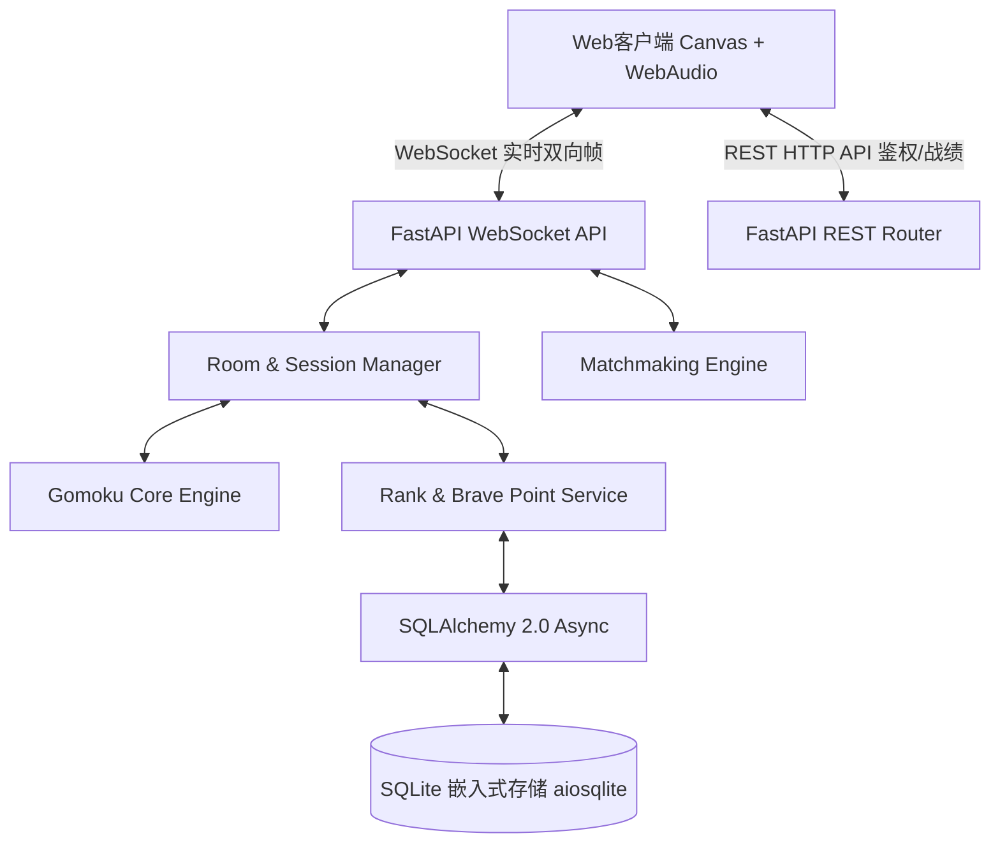
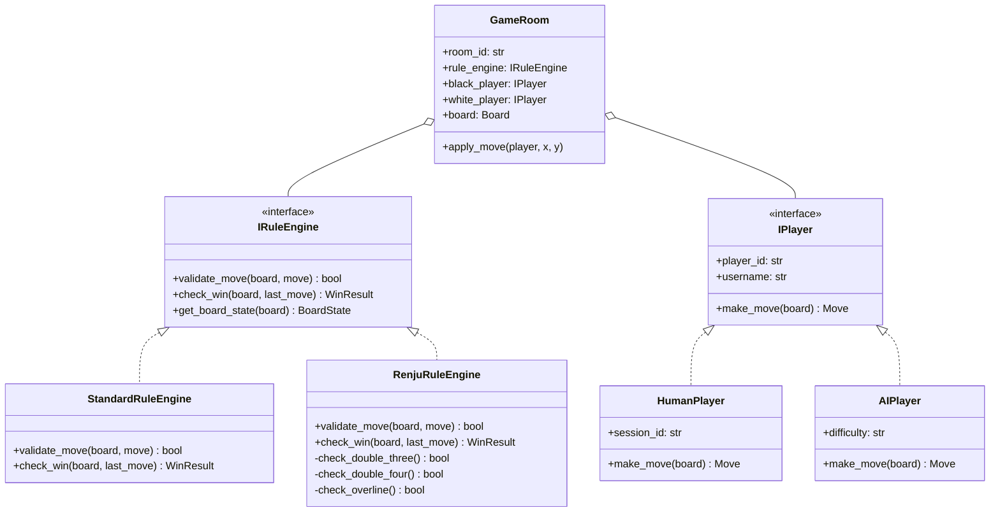
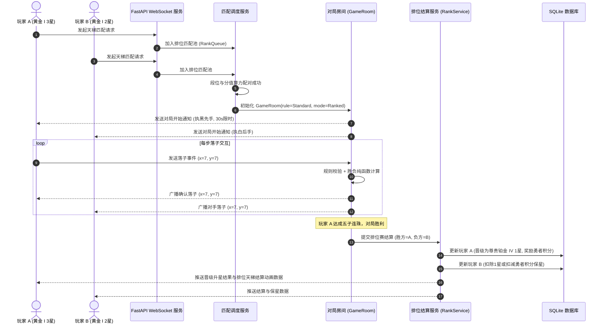

# 联机五子棋项目开发与架构设计文档
**Document Version:** 1.0.0  
**Status:** 待审查 (Pending Review)  
**Author:** Antigravity Architect  

---

## 目录
1. [项目概述与设计原则](#一项目概述与设计原则)
2. [视觉规范（严禁蓝紫色系）](#二视觉规范严禁蓝紫色系)
3. [核心玩法与天梯段位体系](#三核心玩法与天梯段位体系)
4. [技术选型与第三方库引用](#四技术选型与第三方库引用)
5. [系统架构与 SOLID 原则落地](#五系统架构与-solid-原则落地)
6. [目录结构与模块划分](#六目录结构与模块划分)
7. [关键业务流程与协议设计](#七关键业务流程与协议设计)
8. [代码规范与质量保障机制](#八代码规范与质量保障机制)
9. [开发执行路线图](#九开发执行路线图)

---

## 一、项目概述与设计原则

本项目旨在构建一个高水准、规范化、支持全网联机的五子棋在线对战平台。系统支持**好友自由对战（开房/邀请）**、**休闲单人匹配（含智能AI替补对弈）**与**天梯排位赛（采用经典星级天梯段位与胜场勇者积分体系）**。

> [!NOTE]
> **品牌去化规范**：本系统仅借鉴该星级段位机制（青铜至王者之星级与勇者积分抵扣算法），游戏界面、提示、文档及代码中**绝不出现“王者荣耀”等外部游戏字样**，统一采用**【天梯排位 / 棋力段位 / 棋弈天梯】**自主品牌呈现。

### 核心设计原则
1. **严格遵守 PEP 8 规范**：命名规范（snake_case、PascalCase、UPPER_CASE）、静态类型注解（`typing`）、完整 Docstring 文档化。
2. **面向对象 SOLID 原则**：
   - **S (单一职责原则)**：棋盘状态管理、胜负判定、房间管理、匹配池、天梯结算严格解耦。
   - **O (开闭原则)**：规则引擎（普通规则/连珠禁手规则）、匹配策略、AI难度对外部扩展开放，对修改关闭。
   - **L (里氏替换原则)**：所有规则引擎统一继承自 `IRuleEngine` 抽象基类，所有玩家/AI接入同一套玩家接口。
   - **I (接口隔离原则)**：拆分小粒度接口（如 `IMoveValidator`、`IWinChecker`、`IRankCalculator`），杜绝臃肿接口。
   - **D (依赖倒置原则)**：高层业务逻辑依赖抽象协议（如存储接口 `IPlayerRepository`），而非底层 SQLite/Redis 具象实现。
3. **函数式编程（Functional Programming）**：在胜负判定算法、连珠方向向量扫描、只读评估函数中全部使用**无副作用纯函数 (Pure Functions)**。
4. **拒绝重复造轮子**：深度利用现代成熟生态库（FastAPI, WebSockets, SQLAlchemy 2.0 Async, Pydantic v2, aiosqlite）。
5. **严禁蓝紫色（Zero Blue/Purple Policy）**：界面及视觉设计全域排除蓝、靛、紫、青灰等冷色调，统一采用东方雅韵与轻奢木质质感色系。

---

## 二、视觉规范（严禁蓝紫色系）

针对项目要求“**项目不要出现蓝紫色**”，本系统制定了专门的**“东方金石与温润原木”**视觉设计系统：

### 1. 严格禁用的色系清单
- ❌ 绝不出现任何：纯蓝 (`#0000FF`)、天蓝、深蓝、海军蓝 (`Navy`)、青色 (`Cyan`)、靛蓝 (`Indigo`)、紫色 (`Purple`)、紫罗兰 (`Violet`)、洋红/品红 (`Fuchsia`) 等冷蓝冷紫色阶。
- ❌ 前端 CSS/Tailwind 绝不引入 `blue-*`、`sky-*`、`cyan-*`、`indigo-*`、`violet-*`、`purple-*`、`fuchsia-*`。

### 2. 授权采用的色彩方案（东方典雅风格）
| 视觉元素 | 颜色命名 | 色值 (Hex) | 视觉语义 |
| :--- | :--- | :--- | :--- |
| **棋盘背景** | 沉香木纹 / 暖木金 | `#DDB26F` / `#CCA05A` | 经典温润的五子棋木质棋盘纹理 |
| **主背景底色** | 玄武岩黑 / 极夜暖碳 | `#1A1816` / `#23201D` | 沉稳大气的暖暗调背景，防视觉疲劳 |
| **次级卡片/面板** | 沉檀木深褐 | `#2D2824` / `#38322D` | 质感温和的容器面板，辅以琥珀暖边框 |
| **黑子（墨石）** | 墨玉黑曜石 | `#161412` (光影阴影) | 质感浑厚的水墨黑子，具有玉石光晕 |
| **白子（白玉）** | 羊脂暖白玉 | `#F7F4EC` / `#E5DFD1` | 温润乳白，剔透质感，绝非刺眼死白 |
| **主强调色** | 帝王金 / 琥珀金 | `#D4AF37` / `#F59E0B` | 核心操作按钮、段位星级、胜负荣耀标识 |
| **副强调色** | 朱砂印章红 | `#C23B22` / `#DC2626` | 倒计时预警、先手标记、落子指示点 |
| **成功/就绪状态** | 竹青翠玉绿 | `#15803D` / `#16A34A` | 准备就绪、连接成功、在线状态 |
| **文字颜色** | 象牙白 / 暖麻灰 | `#FAF7EE` / `#A8A29E` | 高对比度易读文字 |

---

## 三、核心玩法与天梯段位体系

### 1. 对战模式设计
1. **好友对战 (Friend Room Match)**
   - **创建房间**：房主可自定义规则（每步限时 30s/60s/不限、执子偏好黑/白/随机猜先、是否开启观战）。
   - **房间码与一键邀请**：生成 6 位房间码或一键复制分享链接，好友输入即可进入。
   - **局内互动**：支持求和（Draw）、悔棋申请（Undo Request，房主/对手需同意）、认输（Resign）。
2. **单人匹配 (Casual Matchmaking)**
   - 快速寻找在线实力相近玩家进行无压力对局（不影响排位星数）。
   - **AI保底机制**：若匹配等待超过设定时间（如 10 秒无其他在线玩家），平滑接入智能机器人 AI，确保秒开局不枯等。
3. **天梯排位赛 (Ranked Competitive Match)**
   - 采用 ELO 胜率隐分 + 经典竞技星级段位双重判定。
   - 胜者 +1 星，负者 -1 星（特定保护机制除外）。

---

### 2. 段位体系全景表（经典星级天梯）

| 段位阶层 | 英文标识 | 包含小段位 | 每小段升星所需 | 晋级总星数 | 保星/掉段保护 |
| :--- | :--- | :--- | :---: | :---: | :--- |
| **倔强青铜** | Bronze | 青铜 III → II → I | 3 星 | 9 星 | 青铜段位绝不掉星 |
| **秩序白银** | Silver | 白银 III → II → I | 3 星 | 9 星 | 0星失败仅掉当前小段，不跌入青铜 |
| **荣耀黄金** | Gold | 黄金 IV → III → II → I | 4 星 | 16 星 | 触发掉段保护与勇者积分抵扣 |
| **尊贵铂金** | Platinum | 铂金 IV → III → II → I | 4 星 | 16 星 | 触发勇者积分抵扣 |
| **永恒钻石** | Diamond | 钻石 V → IV → III → II → I | 5 星 | 25 星 | 启用征子/禁手对局，掉星保护 |
| **至尊星耀** | Master | 星耀 V → IV → III → II → I | 5 星 | 25 星 | 高阶段位，掉星保护 |
| **最强王者** | King | 1 段（累积星数） | 0 ~ 24 星 | 25 星 | 按星数累积排名 |
| **荣耀王者** | Glorious King | 荣耀称号 | 25 ~ 49 星 | 25 星 | 全服排名前列标识 |
| **传奇王者** | Legendary King | 传奇称号 | 50 ~ 99 星 | 50 星 | 顶级荣耀 |
| **绝世王者** | Peerless King | 巅峰称号 | 100+ 星 | 无上限 | 巅峰天梯霸主 |

---

### 3. 勇者积分（Brave Points）与保星机制
系统为排位赛引入**勇者积分机制**，防止玩家因意外断线或惜败受挫：
- **积分获得渠道**：
  - 每局完成对弈：基础表现奖励 +10 分；
  - 获得胜利：额外 +15 分；
  - 连胜加成：2连胜 +10分，3连胜 +20分，4连胜以上 +30分；
  - 棋局焦灼表现分（手数超过 60 手）：+5 分。
- **积分抵扣掉星规则**：
  - 黄金：满 150 积分可抵扣一次掉星，抵扣后消耗 150 积分；
  - 铂金：满 200 积分抵扣一次；
  - 钻石/星耀：满 300 积分抵扣一次；
  - 王者：满 400 积分抵扣一次。
- **积分满额奖励升星**：
  - 当勇者积分达到上限且当局获胜时，**额外奖励 1 颗星**，并清空积分阈值。

---

## 四、技术选型与第三方库引用（严禁造轮子）

遵循“能库的调库”原则，全面采用主流、成熟、健壮的开源库：



| 层级 | 选用技术 / 库 | 版本 | 选型理由与职责 |
| :--- | :--- | :--- | :--- |
| **后端核心框架** | `fastapi` | `>=0.110.0` | 极高并发异步处理能力，天然支持 WebSocket 与 Pydantic 校验 |
| **ASGI 服务器** | `uvicorn[standard]` | `>=0.28.0` | 生产级高并发异步 Web 容器 |
| **数据序列化** | `pydantic` | `^2.13.0` (已内置) | 严格的数据模型校验、配置注入与 WebSocket 消息协议序列化 |
| **异步数据库 ORM** | `sqlalchemy` + `aiosqlite` | `>=2.0.0` | 异步现代 ORM，轻量级嵌入式存储，零额外安装，开箱即用 |
| **安全鉴权** | `pyjwt` + `passlib[bcrypt]` | `^2.13.0` (已内置) | JWT 无状态用户会话与密码单向加密存储 |
| **智能对弈底座** | `numpy` (可选矩阵加速) / 自研高效剪枝 | 内置优化 | 函数式连珠评估与快速 Minimax / 极大极小搜索 + 启发式评估 |
| **前端交互与渲染** | `HTML5 Canvas + ES6 Modules` | 现代浏览器标准 | 毫秒级落子渲染、最后手光圈指示、网格吸附、棋盘高分屏自适应 |
| **前端音效库** | Web Audio API (原生合成引擎) | 原生无损 | 物理振荡器合成真实的“清脆木落石”落子音效与敲钟声，零素材依赖 |
| **轻量级粒子效果** | `canvas-confetti` (定制暖金粒子) | CDN/本地库 | 获胜时绽放典雅的暖金与琥珀粒子动效 |

---

## 五、系统架构与 SOLID 原则落地



### SOLID 规范落地细则：
1. **单一职责原则 (Single Responsibility Principle, SRP)**：
   - `Board`：只维护 15×15 棋盘的二维数据矩阵、落子历史记录与快照导出。
   - `StandardRuleEngine` / `RenjuRuleEngine`：只负责规则计算与连珠检测，不感知房间或网络。
   - `RoomManager`：只管理房间生命周期（进房、退房、准备、结算），不直接处理底层数据持久化。
   - `RankService`：只计算段位增减、勇者积分增扣逻辑。
2. **开闭原则 (Open/Closed Principle, OCP)**：
   - 规则判定抽象为 `IRuleEngine`，若后续需增加“连珠国际禁手规则”或“六子棋规则”，只需新增类实现接口，无需修改 `GameRoom` 核心逻辑。
3. **里氏替换原则 (Liskov Substitution Principle, LSP)**：
   - 无论是 `HumanPlayer` 还是 `AIPlayer`，均严格继承自 `IPlayer`。在 `GameRoom` 和匹配调度器中两者完全等价无差别调度。
4. **接口隔离原则 (Interface Segregation Principle, ISP)**：
   - 客户端协议与内部服务分离：
     - `IMoveValidator`（只验证是否合法坐标）
     - `IWinChecker`（只检查是否达成五子）
     - `IBotEngine`（只负责输入棋盘产生落子坐标）
   - 各模块按需依赖，不强迫实现未使用的虚方法。
5. **依赖倒置原则 (Dependency Inversion Principle, DIP)**：
   - 业务层通过构造器注入（Dependency Injection）接口，如 `GameRoom(rule_engine: IRuleEngine)`，对具体规则无硬编码耦合。
   - 持久化使用 Repository 模式，服务层依赖 `IUserRepository` 抽象接口。

---

## 六、目录结构与模块划分

项目按清晰的分层架构（Clean Layered Architecture）设计，组织如下：

```
D:/Gomoku/
├── docs/                               # 项目设计与架构文档
│   └── DEVELOPMENT_PLAN.md             # 本开发规划文档
├── gomoku/                             # 核心 Python 源码包
│   ├── __init__.py                     # 包标识
│   ├── config.py                       # 全局配置（Pydantic BaseSettings）
│   ├── core/                           # [领域核心层] - 纯数学与状态，零外部依赖
│   │   ├── __init__.py
│   │   ├── board.py                    # 棋盘数据结构与状态快照
│   │   ├── constants.py                # 棋盘尺寸(15x15)、方向向量、棋子枚举
│   │   ├── enums.py                    # PieceColor, GameMode, GameStatus, RankTier
│   │   └── rules.py                    # IRuleEngine, StandardRuleEngine, 纯函数向量计算
│   ├── services/                       # [应用业务层] - 核心业务用例
│   │   ├── __init__.py
│   │   ├── room_service.py             # 房间创建、生命周期与指令调度
│   │   ├── match_service.py            # 单人与排位匹配队列池、ELO配对
│   │   └── rank_service.py             # 竞技天梯段位、星数、勇者积分计算器
│   ├── storage/                        # [基础设施持久层] - 仓储接口与实现
│   │   ├── __init__.py
│   │   ├── database.py                 # SQLAlchemy 异步引擎与 SessionLocal
│   │   ├── models.py                   # 数据库 ORM 实体（User, MatchHistory, RankRecord）
│   │   └── repositories.py             # 用户与战绩数据访问仓储（Repository Pattern）
│   ├── api/                            # [传输接入层] - HTTP 与 WebSocket API
│   │   ├── __init__.py
│   │   ├── schemas.py                  # Pydantic 请求/响应/WS消息体定义
│   │   ├── deps.py                     # FastAPI 依赖注入项（当前用户、DB Session）
│   │   ├── routes_auth.py              # 用户注册、游客登录、战绩查询
│   │   ├── routes_rank.py              # 排位天梯排行榜、个人段位展示
│   │   └── ws_handler.py               # WebSocket 事件分发器（对局、心跳、聊天）
│   └── web/                            # [前端表现层] - 现代自适应 Web 客户端
│       ├── index.html                  # 主游戏界面（严格禁用蓝紫色，东方雅韵调）
│       ├── css/
│       │   └── style.css               # 暖木、黑曜石、帝王金、羊脂玉精修配色样式表
│       ├── js/
│       │   ├── app.js                  # 前端核心入口、路由与状态机
│       │   ├── canvas_board.js         # Canvas 15x15 棋盘高清渲染器、落子动画、指示光标
│       │   ├── audio_synth.js          # Web Audio API 原生清脆落子音效与倒计时警报
│       │   ├── ws_client.js            # WebSocket 自动重连与信令客户端
│       │   └── rank_ui.js              # 天梯段位徽章、星级展示与动效
│       └── assets/                     # 本地徽章矢量图标等必要静态资源
├── tests/                              # 自动化测试用例
│   ├── __init__.py
│   ├── test_rules.py                   # 胜负判定与边界测试
│   ├── test_rank.py                    # 天梯段位升星/掉星/勇者积分测试
│   └── test_matching.py                # 匹配池与超时退让逻辑测试
├── requirements.txt                    # 依赖清单
├── .flake8                             # PEP 8 语法检查配置
├── pyproject.toml                      # 构建与代码格式化工具配置 (Black/isort)
├── README.md                           # 部署与启动说明
└── run.py                              # 一键启动脚本 (Uvicorn Launcher)
```

---

## 七、关键业务流程与协议设计

### 1. WebSocket 消息协议规范（JSON Format）
通信协议采用强类型 `type` 路由机制，格式严密：

```json
{
  "action": "move | create_room | join_room | match_queue | surrender | draw_offer | chat",
  "room_id": "string",
  "payload": {
    "x": 7,
    "y": 7,
    "timestamp": 1726368000
  }
}
```

### 2. 排位对局完整时序


---

## 八、代码规范与质量保障机制

1. **PEP 8 规范检测**：
   - 最大行宽限制：`100` 字符（符合现代高分屏阅读习惯）；
   - 遵循 `black` 自动化格式化规范；
   - 采用 `flake8` 进行静态检查，禁止未使用变量、未定义导入、不规范空行；
   - 采用 `mypy` 校验核心计算函数的全类型注解。
2. **单元测试与边界覆盖**：
   - 编写 `tests/test_rules.py` 覆盖各类横向、纵向、斜向、反斜向五子判定；
   - 覆盖边界落子（(0,0), (14,14)）和重叠落子非法防御；
   - 编写 `tests/test_rank.py` 覆盖青铜不掉星、勇者积分满额升星、抵扣掉星等关键场景。

---

## 九、开发执行路线图（待审查确认后启动）

- **阶段一（环境与架构底座）**：创建目录结构、安装依赖、编写核心领域实体（Board, Rules, Enums）并严格遵从 PEP 8 与 SOLID。
- **阶段二（业务服务与天梯算法）**：实现经典天梯段位结算引擎（升星、掉星、勇者积分）、房间调度管理器与高效 AI 对弈引擎。
- **阶段三（API 与 WebSocket 实时通道）**：构建 FastAPI 路由、JWT 游客/注册模式、WebSocket 联机事件分发与匹配队列。
- **阶段四（前端交互与东方雅韵视觉）**：构建 Canvas 15×15 高清棋盘、拟真物理落子声波合成器、全套天梯段位徽章与星级动效（严禁出现任何蓝紫色）。
- **阶段五（全链路联调与自动化测试）**：运行 pytest 自动化测试，联机对弈测试（双开对战、好友开房邀请码对战、排位升星测试），交付完整运行指南。

---
> **审查确认：**
> 如果您对上述架构设计、天梯段位规则、无蓝紫色系视觉规划与技术选型完全满意，请回复“**确认通过**”或提出进一步调整，我将立即开始编码落地！

