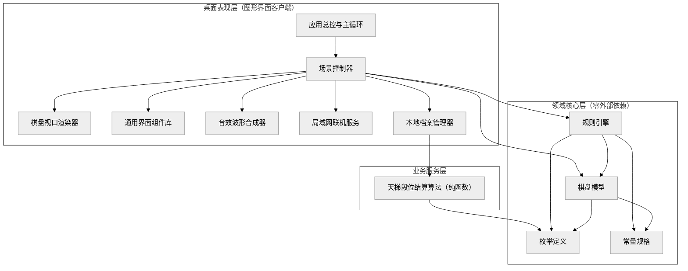
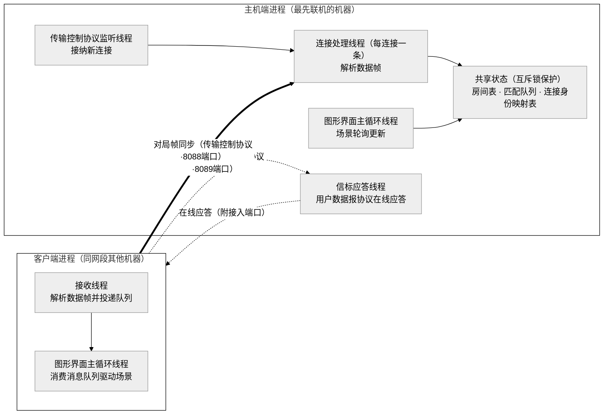
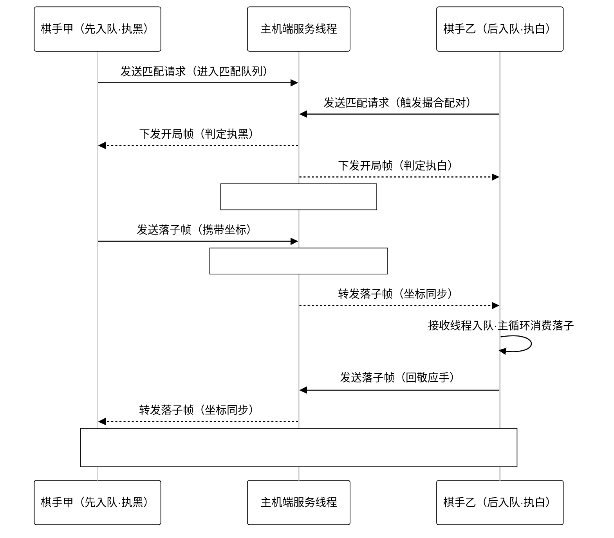

# 五子棋天梯竞技平台 · 产品设计文档

> 版本基准：v1.3.3（依据当前代码库逐模块整理）
> 本文档图表统一采用黑白配色，无任何彩色元素。

---

## 一、产品概述

**五子棋天梯竞技平台**是一款基于 Pygame-ce 引擎构建的原生桌面五子棋联机对战产品，面向**同机房 / 校园网（局域网）**场景，主打零配置自动联机、纯真人博弈与经典天梯段位竞技。

| 维度 | 选型 |
| :--- | :--- |
| 开发语言 | Python 3.13 |
| 桌面引擎 | Pygame-ce 2.5.8（SDL 2.32.10） |
| 网络通信 | 原生 socket 多线程：TCP 8088（房间/撮合/帧同步）+ UDP 8089（发现信标） |
| 数据持久化 | 本地 JSON 档案（gomoku_profile.json） |
| 质量保障 | pytest 20 项单元测试 + flake8（PEP 8，单行 ≤ 100 字符） |
| 分发形态 | PyInstaller 单文件免安装 exe（17.3MB），双击即玩 |

**核心亮点**：

1. **零配置局域网联机**——无需手动输入 IP，UDP 广播自动发现主机，最先联机的机器自动担任主机；
2. **100% 纯真人博弈**——全部 AI 代码已删除，排位/休闲/好友三种模式均为真实棋友对战；
3. **经典天梯体系**——10 大段位、星数升降、勇者积分抵扣与保星保护；
4. **东方金石雅韵视觉**——沉香木棋盘、墨玉黑子与羊脂白玉白子的立体光影，配数学波形合成的国风音效。

---

## 二、产品功能阐述

### 2.1 大厅与个人档案

- 顶部品牌栏与操作区：天梯榜、音效开关；
- 个人排位卡片：当前段位全称（如"荣耀黄金 II (3星)"）、勇者积分进度条、棋手代号、对局胜率（场次数）、当前连胜；
- 三大模式入口卡片：天梯排位赛、单人休闲匹配、好友房间对战，悬浮高亮提示；
- 本地档案持久化：用户名（随机生成"棋客_XXXX"）、段位、星数、积分、战绩保存于 exe 同目录 `gomoku_profile.json`，重启自动恢复。

### 2.2 天梯排位赛

- 点击进入匹配弹窗，向局域网房间服务器注册匹配请求，按队列先到先撮合；
- 撮合成功自动分配黑白执子权（先入队执黑先手），双方同时进入对局；
- 严格回合锁定：仅轮到玩家执子时响应落子点击；
- 胜负计入天梯星级结算：升星晋段、勇者积分、保星保护全部生效；
- 8 秒内无在线对手自动停止检索，弹窗提示"暂无在线棋友"（停留 2 秒后关闭）。

### 2.3 单人休闲匹配

- 同样走局域网撮合流程，自动检索同网段在线棋友；
- 不计天梯星数与段位，纯技艺切磋；
- 匹配中断线自动重新发现主机并重新排队（自动重试一次）。

### 2.4 好友房间码对战

- **创建房间**：一键生成 6 位字母数字房间码（排除易混淆字符），房主持码等待；
- **复制房间码**：房主可一键将房间码复制到系统剪贴板，经聊天工具发给好友；
- **加入房间**：输入 6 位房间码即可远程入座，双方自动同步开局（房主执黑、客方执白）；
- 输入框支持 Ctrl+V 粘贴（自动过滤空格、汉字与全角字符等干扰项）并兼容中文输入法环境（键码兜底识别）；
- 房间码不存在时自动重新检索局域网主机再试一次；满员、断链均有明确提示。

### 2.5 局域网自动发现（联机机制）

- 客户端向受限广播 255.255.255.255、本机各网卡 /24 与 /16 定向广播及回环地址发送 UDP 探测帧；
- 已担任主机的机器通过 LanBeacon 信标（UDP 8089）即时应答"服务器在线"帧（含 TCP 端口）；
- 发现成功则接入远端主机；无应答则本机自动担任主机并对外广播信标；
- 已解析地址本地缓存，链路失效时自动失效缓存并重新发现（断线自愈）；
- 对局中 TCP 链路意外中断时，在线一方判定获胜并正常结算，杜绝无限等待。

### 2.6 对局核心体验

- 标准 15×15 棋盘，天元与四隅星位、A–O / 15–1 坐标刻度；
- 鼠标悬停半透明落子预览，点击按最近交叉点吸附落子；
- 无禁手自由五子棋规则：黑白轮流、同色五连即胜、满盘和棋；
- 最后一手朱砂红印章标记、获胜五子金环连线高亮；
- 主动认输 / 返回大厅判负；对手认输或掉线即时收到通知并判胜；
- 结算弹窗展示胜负、段位变化、勇者积分明细，确认后返回大厅。

### 2.7 段位与勇者积分体系

- 10 大段位阶梯：倔强青铜 → 秩序白银 → 荣耀黄金 → 尊贵铂金 → 永恒钻石 → 至尊星耀 → 最强王者 → 荣耀王者（25星）→ 传奇王者（50星）→ 绝世王者（100星）；
- 子段位结构：青铜/白银各 3 段、黄金/铂金各 4 段、钻石/星耀各 5 段，王者以上星数累积；
- 胜场 +1 星（勇者积分满额时额外 +1 星并扣减阈值积分）；
- 败场 −1 星并降段推演，触发两级保护：青铜失败绝不掉星、白银 0 星不跌入青铜；
- 勇者积分：完赛 +10、获胜 +15、连胜递增（2/3/4+ 连胜 +10/+20/+30）、焦灼局（≥60 手）+5；达阈值可抵扣掉星。

### 2.8 视觉与音效

- 视觉主题"东方金石雅韵与温润沉香木"：沉香文人茶室背景、暖炭黑底、琥珀金主按钮、朱砂红警示；
- 棋子立体光影：墨玉黑曜石渐变高光、羊脂白玉漫反射弧光；
- 四类音效全部由数学波形实时合成（零音频文件依赖）：沉香木落子脆响（2200Hz 瞬态 + 260Hz 回响）、按键短促音、获胜宫商角徵羽五音上行旋律、惜败低缓三音；
- 无声卡环境毫秒级回退 dummy 驱动，绝不阻塞启动。

---

## 三、功能模块图

```mermaid
%%{init: {"theme": "neutral", "themeVariables": {"primaryColor": "#ffffff", "primaryBorderColor": "#000000", "primaryTextColor": "#000000", "lineColor": "#000000", "secondaryColor": "#ffffff", "secondaryBorderColor": "#000000", "tertiaryColor": "#ffffff", "tertiaryBorderColor": "#000000", "clusterBkg": "#ffffff", "clusterBorder": "#000000", "edgeLabelBackground": "#ffffff", "fontFamily": "Microsoft YaHei, SimHei, sans-serif"}}}%%
flowchart TD
    ROOT["五子棋天梯竞技平台"]

    ROOT --> M1["大厅与档案模块"]
    ROOT --> M2["匹配对战模块"]
    ROOT --> M3["好友房间模块"]
    ROOT --> M4["局域网联机模块"]
    ROOT --> M5["对局核心模块"]
    ROOT --> M6["段位结算模块"]
    ROOT --> M7["视听表现模块"]

    M1 --> M1A["个人排位卡"]
    M1 --> M1B["天梯大师榜"]
    M1 --> M1C["音效开关"]
    M1 --> M1D["本地档案持久化"]

    M2 --> M2A["天梯排位匹配"]
    M2 --> M2B["单人休闲匹配"]
    M2 --> M2C["超时停止检索"]
    M2 --> M2D["断线自动重试"]

    M3 --> M3A["一键创建房间"]
    M3 --> M3B["房间码远程加入"]
    M3 --> M3C["异常校验提示"]

    M4 --> M4A["广播发现主机"]
    M4 --> M4B["自任主机服务"]
    M4 --> M4C["地址缓存自愈"]
    M4 --> M4D["撮合与房间管理"]
    M4 --> M4E["落子帧双向转发"]

    M5 --> M5A["棋盘渲染吸附"]
    M5 --> M5B["执子回合锁定"]
    M5 --> M5C["五连珠判定"]
    M5 --> M5D["认输断线判定"]
    M5 --> M5E["结算弹窗"]

    M6 --> M6A["段位升降换算"]
    M6 --> M6B["勇者积分抵扣"]
    M6 --> M6C["两级段位保护"]

    M7 --> M7A["国风视觉主题"]
    M7 --> M7B["棋子立体光影"]
    M7 --> M7C["波形合成音效"]
```

---

## 四、系统架构

### 4.1 分层架构图

全工程严格落实三层架构与 SOLID 原则，依赖方向自上而下单向流动（表现层 → 服务层 → 核心层），核心层零外部依赖。

### 4.2 联机运行时架构图（线程模型）

局域网内最先进入联机的机器自动担任主机；每个进程内部以多线程协作：图形界面主循环线程驱动场景轮询，网络线程收发帧并投递至消息队列。

### 4.3 落子帧同步时序图

对局期间双方落子均经由主机端转发，主机通过 `conn_room_map` 连接身份映射表定位房间与对手，保证撮合与房间码两种开局路径下落子双向可达。

### 4.4 模块职责清单

| 分层 | 模块 | 核心职责 |
| :--- | :--- | :--- |
| 入口 | run.py / desktop_app.py | 桌面客户端启动入口 |
| core | board.py | 15×15 棋盘矩阵、落子/悔棋/快照/克隆，坐标边界校验 |
| core | rules.py | IRuleEngine 抽象 + StandardRuleEngine：落子合法性（边界、空位、黑白交替）与五连珠四方向增量扫描判定 |
| core | enums.py | 棋子颜色、对战模式、对局状态、胜负原因、天梯段位枚举 |
| core | constants.py | 棋盘规格 15、连珠数 5、四方向扫描向量 |
| services | rank_service.py | 段位结算纯函数：升星晋段、降段衰减、王者称号换算、勇者积分与两级保护 |
| gui | app.py | 窗口生命周期、事件分发、场景流转、60 FPS 主循环 |
| gui | scenes.py | LobbyScene（大厅、匹配、房间弹窗）与 GameScene（对局、网络帧同步、结算） |
| gui | board_view.py | 像素 ↔ 网格换算、棋盘/棋子/连线渲染、悬停预览 |
| gui | components.py | Button、Card、ProgressBar、ModalDialog、TextInput 与字体缓存 |
| gui | audio.py | 落子/点击/胜/负四类音效的数学波形合成与播放调度 |
| gui | room_net.py | RoomHostServer（TCP 房间服务器）、LanBeacon（UDP 信标）、RoomClient 与发现/解析函数 |
| gui | profile.py | 档案加载与持久化、结算对接、天梯大师榜数据生成 |

### 4.5 关键设计决策

1. **conn_room_map 跨线程身份映射**：服务器每连接一线程，撮合建房发生在后入队方线程，通过"连接 → (房间号， 是否房主)"映射表跨线程登记双方，解决先入队房主线程阻塞于 recv 而无法转发落子的缺陷；
2. **开局帧后同批消息回填**：大厅轮询一次排干消息队列后，处理 start 帧时将同批后续落子/认输帧回填客户端队列，交由对局场景消费，杜绝界面卡顿或对手快攻时首手丢失；
3. **主机自任与地址缓存**：`resolve_room_host()` 优先接入已发现的远端主机，无应答时本机担任主机并广播信标，全程零配置；缓存失效后自动重试实现链路自愈；
4. **换行分隔 JSON 帧协议**：所有 TCP 消息以 `\n` 结尾的 JSON 传输，接收端缓冲切分；客户端接收线程仅入队，GUI 主线程统一轮询消费，避免跨线程 UI 竞态；
5. **规则与结算纯函数化**：连珠判定基于棋盘快照扫描、段位结算为无状态纯函数，便于单元测试与未来扩展禁手规则（开闭原则）。

---

*本文档随代码演进同步更新，详细变更履历见 [OPERATIONS.md](./OPERATIONS.md)。*
